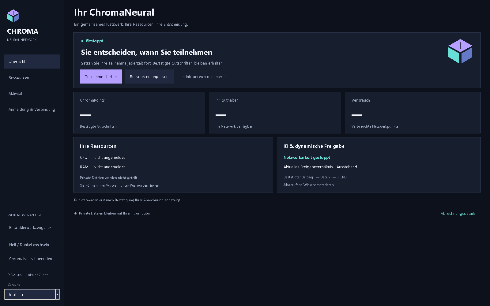
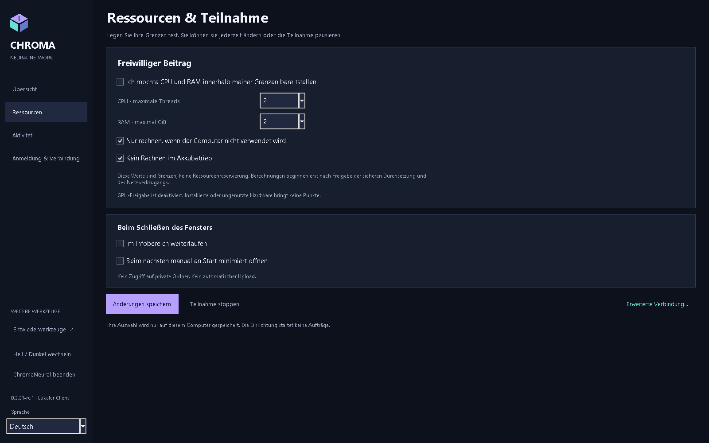
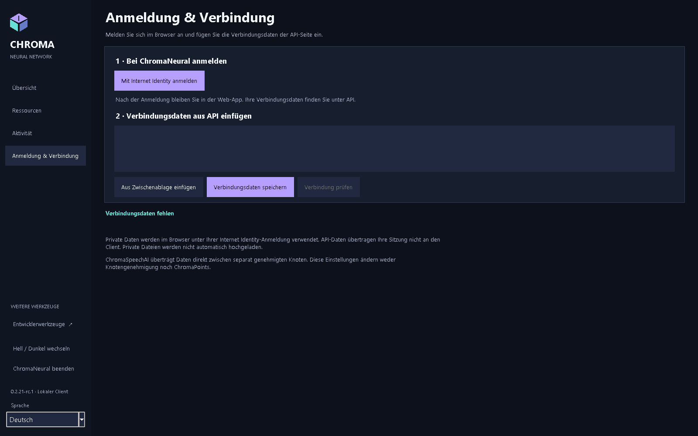
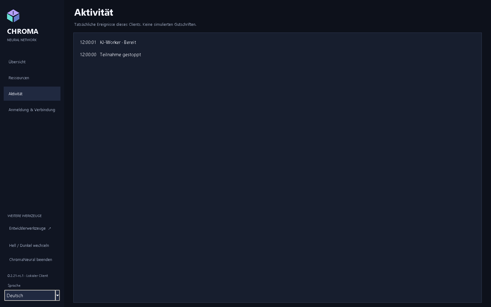

<p align="center"></p>
<p align="center"><strong>ChromaNeural 0.2.21-rc.4</strong><br>Release Candidate / Vorabversion</p>
<p align="center"><a href="RELEASE_NOTES.md">RC4</a> · <a href="docs/de/ChromaNeural-Installation.md">Installation</a> · <a href="docs/README.md">Dokumentation und englische PDFs</a> · <a href="VERIFICATION.md">Verifizierte Funktionen</a> · <a href="KNOWN_LIMITATIONS.md">Einschränkungen</a></p>

# ChromaNeural

**RC4 erscheint nur für Windows x64 und Linux amd64. macOS, Android und iOS gehören nicht zum Umfang dieser Veröffentlichung.**

[English](README.md) · [Dansk](README-DK.md) · [Deutsch](README-DE.md) · [Français](README-FR.md) · [日本語](README-JA.md) · [简体中文](README-ZH-CN.md) · [हिन्दी](README-HI-IN.md)

**RC4 lokaler Kandidat: NICHT VERÖFFENTLICHT.** Die neue Paket- und Sicherheitsabnahme steht aus. Frühere Funktionsnachweise gelten nur bei unveränderten Quellcode-Hashes. [Status und Grenzen](RELEASE_NOTES.md).

**Lokale KI-Arbeit, authentifizierte Peer-Zusammenarbeit und eine klare Grenze zwischen privater Arbeit und geteilten Ergebnissen.**

ChromaNeural ist Desktop-Client und Softwareframework für ausdrücklich genehmigte KI-Arbeit. Es verbindet dauerhafte lokale Warteschlange, wählbare lokale KI-Anbieter, authentifizierten ChromaSpeechAI-Peer-Transport und einwilligungsgesteuerte Ergebnisveröffentlichung. Das unterstützte Zusammenarbeitsprofil sind **Codevorschläge**, kein allgemeines System für beliebige entfernte Aufträge.

Die historische rc.1-Version lieferte getestete Software für **Windows, Linux und macOS** innerhalb plattformspezifischer Grenzen. Echte Zwei-Computer-LAN-Tests, direkter Mobilfunk-zu-Heimnetz-WAN-Test und tatsächliche lokale Modellinferenz ergänzen native Paketprüfungen. **Live-Zulassung, Migration und Internet Identity-Ende-zu-Ende des Produktionsnetzes sind noch nicht verifiziert.** Installation verbindet nicht mit einem Verdienstnetz und stellt kein Backend bereit.

## Was ChromaNeural unterscheidet

- **Lokale Arbeit zuerst.** Einen Arbeitsbereich zu öffnen lädt ihn nicht hoch. Ein lokaler Anbieter verarbeitet ausdrücklich gewählte Eingaben auf Ihrem Computer.
- **Zusammenarbeit ist bewusst.** Peer-Identität, Auftragsgenehmigung und Einwilligung zur Quelltextoffenlegung bleiben getrennt. Empfangene Inhalte bleiben Daten und werden nicht automatisch ausgeführt.
- **Integrität ist keine Wahrheit.** Gleiche SHA-256-Hashes belegen Byteidentität, weder verifizierte KI-Antworten noch Veröffentlichungsberechtigung.
- **Identität hat Grenzen.** Die menschliche Internet Identity-Sitzung bleibt im Browser. Der Node hat eine eigene Signieridentität; ein kopierter Principal ist keine Anmeldeinformation.
- **Veröffentlichung ist eine eigene Entscheidung.** Private Dateien, lokale Ergebnisse und Shared Network Knowledge sind keine austauschbaren Speicherbereiche. Verifikation, Einwilligung, Rollen und Backend-Annahme gelten weiterhin.

Dies sind konkrete Softwaregrenzen, kein Versprechen von Anonymität, verschlüsseltem lokalem Speicher oder universeller KI-Korrektheit. Siehe [Datenschutz und Speicherung](docs/de/ChromaNeural-Privacy-and-Storage.md).

## Sprache im rc.3-Client

Ein Client unterstützt English, Dansk, Deutsch, Français, 日本語, 简体中文 und हिन्दी. Englisch ist unabhängig von der Betriebssystemsprache Standard und Rückfallsprache. Die Sprachauswahl in der Seitenleiste ändert die anwendungseigenen Texte sofort. Eingaben, Quelltext, Verbindungs-JSON und Teilnahmestatus bleiben erhalten; ein Sprachwechsel startet weder einen weiteren Worker noch eine Netzwerkprüfung. Betriebssystemeigene Dateiauswahldialoge behalten die Betriebssystemsprache.

Eine ausdrückliche GUI-Auswahl speichert nur Version und Gebietsschema in `ui-language.json` neben der bestehenden `preferences.json`. Deren Schema bleibt unverändert; es entsteht kein zweites Zustandsverzeichnis. Beim nächsten Start wird die Auswahl wiederhergestellt. Fehlende, ungültige, übergroße oder nicht unterstützte Spracheinstellungen führen zu Englisch, ohne das Original zu überschreiben. Ein späteres ausdrückliches Speichern bewahrt ein ungültiges Original; bei einem Speicherfehler bleibt die aktuelle Sprache erhalten.

Das optionale CLI-Argument `--language` überschreibt die Sprache nur für diesen Start, ohne die Auswahl zu speichern. Die Windows-Starter reichen `-Language` weiter. Unterstützte Kennungen stammen aus `client/locale-registry.json`; zunächst werden `en`, `da`, `de`, `fr`, `ja`, `zh-CN` und `hi-IN` ausgeliefert. Eine zukünftige Sprache benötigt einen Katalog mit denselben Nachrichtenschlüsseln und einen Registry-Eintrag mit Anzeigename und Zahlenformatmetadaten. Das vorübergehende achte Testgebietsschema wird nicht ausgeliefert.

## Ein Blick hinein

<p align="center">

</p>

<table>
<tr>
<td width="50%" valign="top">
<br>
<strong>Ihre Ressourcenwahl</strong><br>CPU, Threads, Speicher und Teilnahme.
</td>
<td width="50%" valign="top">
<br>
<strong>Browseranmeldung, separate Clientverbindung</strong><br>Keine Internet Identity-Sitzung wird an den Desktop übertragen.
</td>
</tr>
</table>

<details>
<summary>Aktivität und Aufnahmekontext</summary>
<p align="center">

</p>
</details>

[Verifizierte Aufnahmen](docs/images/rc2/README.md) · [Herkunft der Aufnahmen](docs/SCREENSHOTS.md) · [Dokumentation und englische PDFs](docs/README.md).

## Was die Software leistet

| Funktion | Verfügbarer Umfang |
|---|---|
| Hintergrundarbeit | Bereits genehmigte lokale Aufträge in bestehender dauerhafter Warteschlange mit Leases, Pause, Abbruch, Stopp und Neustart. |
| Lokale KI-Anbieter | Gebündelte CPU/Qwen-Inferenz für Windows/Linux; ausdrücklich gewählter lokaler Ollama-Adapter mit Modell. Kein stiller Anbieterwechsel. macOS ohne gebündelte Inferenzlaufzeit. |
| Peer-Zusammenarbeit | Genehmigte Fragen und Antworten bleiben über bestehenden TLS-Transport und SQLite-Posteingang mit dem ursprünglichen Codevorschlagsauftrag verbunden. |
| Ressourcenkontrolle | Dokumentiertes Windows-Profil steuert CPU-Zeitplanung, Inferenzthreads, zugesicherten Speicher und Lebenszyklus. Gesamter physischer RAM ist nicht garantiert. Andere kontrollierte Anbieter-/OS-Profile werden sicher abgelehnt. |
| Ergebnisse | Lokale und Peer-Beiträge behalten Herkunft und Prüfstatus. Ausgabe bleibt unverifiziert, bis die bestehende maßgebliche Verifikation sie akzeptiert. |
| Veröffentlichung | Bestehende Software mit Einwilligung, Verifikation und Rollen ist lokal getestet. Diese Vorabversion belegt keinen öffentlichen Live-Ergebnisdienst. |
| Verbindung | Der Desktop prüft die öffentliche Backend-API anonym. Private Browseranmeldung und separat autorisierte Node-Einrichtung sind andere Vorgänge. |

**Allgemeine Ressourcenfreigabe bleibt deaktiviert.** Gespeicherte Präferenz oder erfolgreiche öffentliche API-Prüfung bedeuten weder Zulassung noch aktiven Beitrag oder ChromaPoints. Diese RC hat keine allgemeine Aufgaben-Schaltfläche für beliebige Probleme; erweiterte Warteschlangen-/Zusammenarbeitsfunktionen nutzen die bestehende CLI.

## Arbeitsablauf im System

```text
Lokale Eingabe + ausdrückliche Genehmigungen
              |
       Bestehende Warteschlange
              |
    Lokaler Anbieter / genehmigter Peer-Austausch
              |
     Korreliertes Ergebnis + Integritätsprüfungen
              |
       Prüfung / Verifikation
              |
  Optionale Veröffentlichung nach bestehenden Regeln
```

Keine automatische Ausführung empfangenen Peer-Codes, keine Selbstverifikation der KI und keine Punkte allein für Speichern/Herunterladen. Direkter privater Auftraggeber-Download vor optionaler globaler Veröffentlichung ist in dieser Version zurückgestellt.

## Datenschutz, Speicherung und Browser

Einstellungen, Warteschlange und Protokolle speichert der Desktop lokal. Ein Arbeitsbereich bleibt ein normaler Ordner unter Ihrer Kontrolle. Aufträge können Quelltext, Anweisungen, Ergebnisse und lokale Pfade enthalten: **schützen Sie sie als private Daten**. Lokaler Zustand wird nicht von der Anwendung verschlüsselt.

| Ort | Standard |
|---|---|
| Windows-Clientzustand | `%LOCALAPPDATA%\ChromaNeural\client` |
| Linux-/macOS-Clientzustand | `${XDG_STATE_HOME:-$HOME/.local/state}/chroma-neural/client` |
| Arbeitsdateien | Ausdrücklich gewählter Ordner; kein automatischer Upload des gesamten Ordners |
| Private Browserdaten | Bestehende Webanwendung unter dem authentifizierten Internet Identity-Aufrufer |

`--state-dir` oder `CHROMA_STATE_DIR` wählen ein anderes Zustandsverzeichnis. Node-Identität/-Konfiguration und Peer-Posteingänge haben eigene ausdrücklich gewählte Pfade. [Dateinamen, Aufbewahrung und Sitzungsgrenzen](docs/de/ChromaNeural-Privacy-and-Storage.md).

**Private II storage** informiert in dieser Version nur. Nativer privater Datei-Upload/-Download mit Browser-Eigentümerberechtigung ist nicht implementiert. Nutzung der Webanwendung überträgt keine Sitzung an den Node. Lokale Datenschutz-/Zugriffsschutzprüfung belegt keine Bereitstellung dieser Korrekturen im Live-Dienst.

## Historische rc.1-Plattformen und Downloads

| Offizielle Vorabplattform | Download | Verifizierter Umfang |
|---|---|---|
| Windows x64 | [Windows-EXE](RELEASE_NOTES.md) | Saubere native Installation, SDK/CLI/Tk, Payloadintegrität, manuelle Windows-GUI-Abnahme |
| Linux amd64 | [Debian-Paket](RELEASE_NOTES.md) | Native Ubuntu-24.04-Erstellung, Entpacken, SDK/CLI, Xvfb/Tk; kein vollständiger Installations-/Entfernungszyklus |
| Quellcode | [Akzeptierte Quellcode-ZIP](RELEASE_NOTES.md) | Quellcode der akzeptierten Veröffentlichung; Dokumentation kann neuer sein |

**Voraussetzungen:** Windows: Python 3.14 mit Tk, `py`/`pyw`, Node.js 24. Linux: Python 3.11+, Tk, cryptography, Node.js 20+, libgomp1. macOS: macOS 15+, Python 3.14/Tk, Node.js 24 und festgelegte Python-Kryptografieabhängigkeiten. Lesen Sie vor dem Download die [Installation](docs/de/ChromaNeural-Installation.md).

Pakete sind **unsigniert**, macOS **nicht notarisiert**. Keine Universal-2-Version. Betriebssystemwarnungen sind möglich. Einschränkungen der Linux-/macOS-Starter- und Windows-Installersymbole stehen im [Brandingstatus](docs/BRANDING.md).

Offizielle Android- und iOS-Unterstützung ist auf später verschoben.

### Download prüfen

Laden Sie [SHA256SUMS.txt](RELEASE_NOTES.md) mit dem Paket herunter. Windows: `Get-FileHash -Algorithm SHA256`; Linux: `sha256sum`; macOS: `shasum -a 256`. Vergleichen Sie den vollständigen Wert zum genauen Dateinamen. SHA-256 prüft Bytes, nicht Herausgeberidentität. [Alle veröffentlichten Hashes und Befehle](docs/DOWNLOADS.md).

GitHub änderte den DEB-Downloadnamen von `~rc.1` auf `.rc.1`. Bytes und Inhaltshash sind unverändert.

## Dokumentation

Die erhaltene rc.2-Dokumentationsbasis ist VERIFIED/PASS: 35 PDFs in sieben Sprachen, 195 visuell geprüfte Seiten, eingebettete/unterteilte Schriftarten und verifizierte Hindi-Unicode-Extraktion. [Verifizierte PDFs](docs/pdf/rc2/README.md) und [28 verifizierte Aufnahmen](docs/images/rc2/README.md) behalten ihre ursprüngliche Herkunft. Die rc.1-PDF-Links unten sind historisch. MCP wird im gesonderten Ergänzungstext beschrieben.

| Handbuch | Markdown | Historisches englisches rc.1-PDF |
|---|---|---|
| Überblick | [System und Ablauf](docs/de/ChromaNeural-Overview.md) | [Überblick](docs/pdf/ChromaNeural-Overview.pdf) |
| Benutzerhandbuch | [Client verwenden](docs/de/ChromaNeural-User-Guide.md) | [Benutzerhandbuch](docs/pdf/ChromaNeural-User-Guide.pdf) |
| Datenschutz und Speicherung | [Daten, Pfade, Identität](docs/de/ChromaNeural-Privacy-and-Storage.md) | [Datenschutz und Speicherung](docs/pdf/ChromaNeural-Privacy-and-Storage.pdf) |
| Installation | [Windows, Linux, macOS](docs/de/ChromaNeural-Installation.md) | [Installation](docs/pdf/ChromaNeural-Installation.pdf) |
| Verifizierte Funktionen | [Belege und Grenzen](docs/de/ChromaNeural-Verified-Capabilities.md) | [Verifizierte Funktionen](docs/pdf/ChromaNeural-Verified-Capabilities.pdf) |

Für Entwickler: [Reproduktion und Nachweise](VERIFICATION.md), [Mitwirken](CONTRIBUTING.md), [Änderungsprotokoll](CHANGELOG.md), [Lizenzgrenzen](docs/LICENSING.md).

## Was außerhalb der Abnahme bleibt

Live-Internet Identity-Ende-zu-Ende, Live-Zulassung und Live-Migration bleiben **NICHT VERIFIZIERT**. Native private Dateiintegration und direkter privater Eigentümer-Ergebniszugriff sind nicht geliefert. Kontrollierte Ressourcenbeiträge außerhalb des dokumentierten Windows-Profils sind nicht unterstützt. Umgekehrte WAN-Initiierung war durch die Testumgebung begrenzt. Siehe [alle bekannten Grenzen](KNOWN_LIMITATIONS.md).

Dies ist **Softwaredokumentation**. Tatsächlicher LAN-/WAN-Transport und tatsächliche Modellinferenz werden von lokalen/Mock-Tests unterschieden. Spezialisierte GPU-, optische oder andere Hardwareleistung wird nicht als physisch verifiziert behauptet.

In rc.3 bleibt ChromaSpeechAI Node-zu-Node; optionales MCP dient Node-zu-Werkzeug. ChromaNeural funktioniert ohne MCP. Verbindungen und einzelne Werkzeuge benötigen ausdrückliche Genehmigung.

## Open Source und Beiträge

Eigener Code und Dokumentation von ChromaNeural verwenden **Apache License 2.0**. Die vier dokumentierten Refract-Editor-Dateien bleiben **MIT**, ebenso die benannten ChromaPlex/CPL/CPA- und ChromaSpeechAI-Komponenten. **PRISME behält separate restriktive Bedingungen und wird hier nicht neu lizenziert.** Andere Abhängigkeiten behalten ihre Hinweise. Lesen Sie [LICENSE](LICENSE), [NOTICE](NOTICE), [THIRD_PARTY_LICENSES.md](THIRD_PARTY_LICENSES.md) und [den genauen Umfang](docs/LICENSING.md).

Fehlerberichte, Dokumentationsverbesserungen und kompatible Beiträge sind willkommen. Folgen Sie [CONTRIBUTING.md](CONTRIBUTING.md); hängen Sie keine privaten Identitäten, Warteschlangendatenbanken, Sitzungsdaten oder unbereinigten Protokolle an. Sicherheitsprobleme melden Sie nach [SECURITY.md](SECURITY.md).


MCP und integrierte KI-/Werkzeugeinrichtung: VERIFIED/PASS. Das echte Modell `qwen3:4b-instruct` mit Ollama 0.35.1 rief ein genehmigtes kontrolliertes MCP-Werkzeug auf, erhielt dessen exaktes Ergebnis in der nächsten Inferenzanfrage und nutzte es in der endgültigen Antwort. Normale Inferenz bei deaktiviertem oder nicht verfügbarem MCP bestand ebenfalls. Dies zertifiziert nicht alle Modelle oder externen Dienste. Siehe [MCP und Einrichtung (Englisch)](docs/MCP_ONBOARDING.md).
