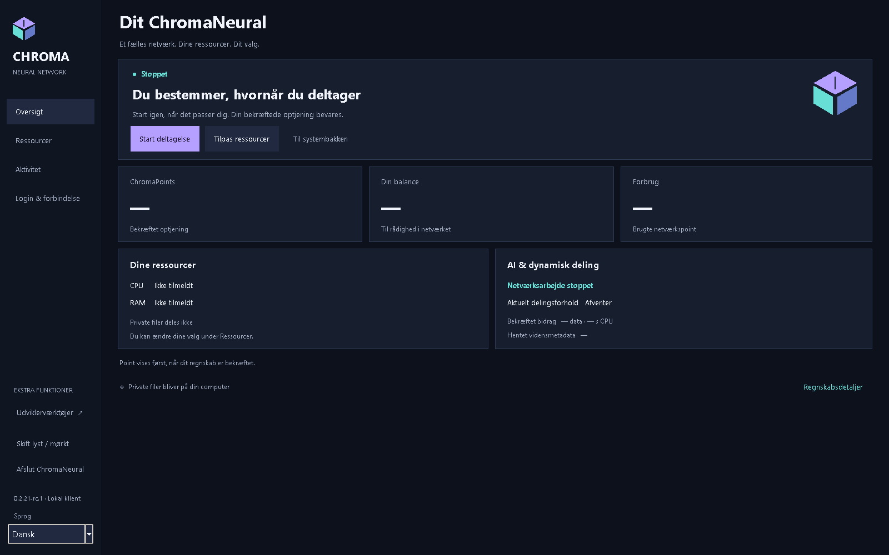
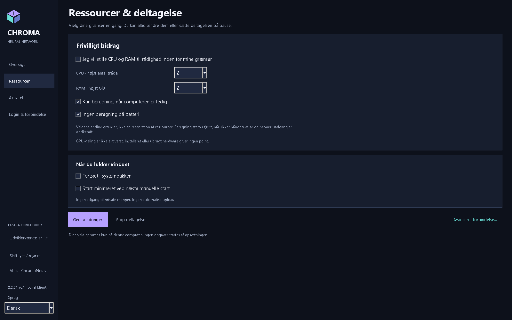
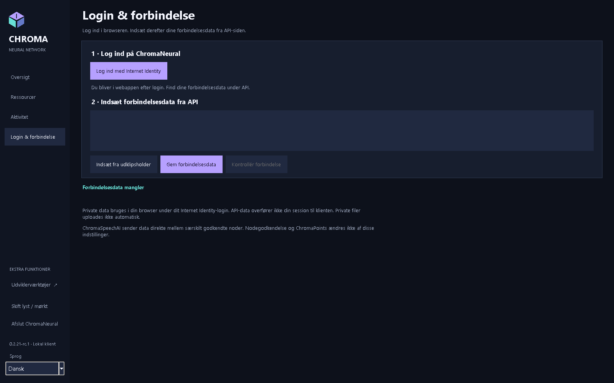
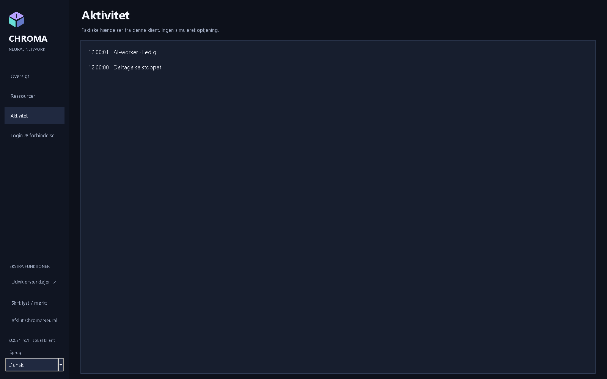

<p align="center"></p>

<p align="center"><strong>ChromaNeural 0.2.21-rc.4</strong><br>Udgivelseskandidat / prerelease</p>
<p align="center"><a href="RELEASE_NOTES.md">RC4</a> · <a href="docs/da/ChromaNeural-Installation-DA.md">Installation</a> · <a href="docs/README.md">Dokumentation og engelske PDF'er</a> · <a href="VERIFICATION.md">Verificerede funktioner</a> · <a href="KNOWN_LIMITATIONS.md">Begrænsninger</a></p>

# ChromaNeural

**RC4 udgives kun til Windows x64 og Linux amd64. macOS, Android og iOS er uden for denne udgivelse.**

[English](README.md) · [Dansk](README-DK.md) · [Deutsch](README-DE.md) · [Français](README-FR.md) · [日本語](README-JA.md) · [简体中文](README-ZH-CN.md) · [हिन्दी](README-HI-IN.md)

**RC4 lokal kandidat: IKKE UDGIVET.** Ny pakke- og sikkerhedsaccept afventer. Tidligere verificeret funktionalitet genbruges kun ved uændrede kildehashes. [Aktuel status og begrænsninger](RELEASE_NOTES.md).

**Lokalt AI-arbejde, autentificeret peersamarbejde og en klar grænse mellem privat arbejde og delte resultater.**

ChromaNeural er en desktopklient og et softwareframework til udtrykkeligt godkendt AI-arbejde. Det kombinerer en vedvarende lokal arbejdskø, valgbare lokale AI-udbydere, autentificeret ChromaSpeechAI-peertransport og samtykkestyret resultatpublicering. Den understøttede samarbejdsprofil er **kodeforslag**; det er ikke et generelt system, der accepterer vilkårligt fjernarbejde.

Den historiske rc.1-udgivelse leverede testet software til **Windows, Linux og macOS** med platformspecifikke begrænsninger. Faktiske LAN-test mellem to computere, en direkte WAN-test fra mobilnet til hjemmenet og reel lokal modelinference supplerer native pakkekontrol. **Produktionsnetværkets faktiske admission, migration og Internet Identity-forløb fra ende til ende er endnu ikke verificeret.** Installation tilslutter ikke et netværk med indtjening og deployer ingen backend.

## Hvorfor ChromaNeural er anderledes

- **Lokalt arbejde er udgangspunktet.** En åbnet arbejdsmappe uploades ikke. En lokal udbyder behandler udtrykkeligt valgt input på din computer.
- **Samarbejde er et bevidst valg.** Peeridentitet, jobgodkendelse og samtykke til kildekodedeling er adskilt. Modtaget indhold forbliver data og udføres ikke automatisk.
- **Integritet er ikke sandhed.** Ens SHA-256-hashværdier beviser byteidentitet, ikke at et AI-svar er verificeret eller må offentliggøres.
- **Identitet har grænser.** Din personlige Internet Identity-session forbliver i browseren. En node har sin egen signeringsidentitet; et kopieret Principal-id er ikke en loginoplysning.
- **Publicering er en særskilt beslutning.** Private filer, lokale resultater og Shared Network Knowledge er forskellige lagringsområder. Verifikation, samtykke, roller og backendaccept gælder stadig.

Det er konkrete softwaregrænser, ikke et løfte om anonymitet, krypteret lokal lagring eller universelt korrekte AI-svar. Se [guiden om privatliv og lagring](docs/da/ChromaNeural-Privacy-and-Storage-DA.md).

## Sprog i rc.3-klienten

Én klient understøtter English, Dansk, Deutsch, Français, 日本語, 简体中文 og हिन्दी. Engelsk er standard og fallback uanset operativsystemets sprog. Brug sprogvælgeren i sidepanelet til straks at ændre programmets egne tekster. Eksisterende input, kildekode, forbindelses-JSON og deltagelsesstatus bevares; et sprogskift starter ikke endnu en worker eller netværkskontrol. Operativsystemets egne filvælgerkontroller beholder OS-sproget.

Et udtrykkeligt sprogvalg i GUI'en gemmer kun version og locale i `ui-language.json` ved siden af den eksisterende `preferences.json`. Det ændrer ikke denne fils skema og opretter ikke en ekstra statemappe. Valget gendannes ved næste start. Manglende, ugyldige, for store eller ikke understøttede sprogpræferencer giver engelsk fallback uden at overskrive originalen. En senere udtrykkelig gemning bevarer en ugyldig original; hvis gemning fejler, beholdes det aktuelle sprog.

Det valgfrie CLI-argument `--language` tilsidesætter sproget for den pågældende start uden at gemme valget. Windows-launcherne videresender `-Language`. Understøttede locale-id'er kommer fra `client/locale-registry.json`; det første leverede sæt er `en`, `da`, `de`, `fr`, `ja`, `zh-CN`, `hi-IN`. Et fremtidigt sprog kræver ét katalog med de samme meddelelsesnøgler og én registreringspost med navn og metadata for talformat. Det midlertidige ottende testsprog leveres ikke.

## Et kig indenfor

<p align="center">

</p>

<table>
<tr>
<td width="50%" valign="top">
<br>
<strong>Dine ressourcevalg</strong><br>Præferencer for CPU, tråde, hukommelse og deltagelse.
</td>
<td width="50%" valign="top">
<br>
<strong>Browserlogin og separat klientforbindelse</strong><br>Ingen Internet Identity-session overføres til desktopklienten.
</td>
</tr>
</table>

<details>
<summary>Aktivitet og skærmbilledernes kontekst</summary>
<p align="center">

</p>
</details>

[Verificerede skærmbilleder](docs/images/rc2/README.md) · [Skærmbilledernes oprindelse](docs/SCREENSHOTS.md) · [Dokumentation og engelske PDF'er](docs/README.md).

## Hvad softwaren gør

| Funktion | Hvad der er tilgængeligt |
|---|---|
| Baggrundsarbejde | Allerede godkendte lokale job kører gennem den eksisterende vedvarende kø med leases, pause, annullering, stop og genstart. |
| Lokale AI-udbydere | Medfølgende CPU/Qwen på Windows/Linux og en udtrykkeligt valgt lokal Ollama-adapter med valgt model. Ingen skjult fallback. macOS har ingen medfølgende inferenceruntime. |
| Peersamarbejde | Godkendte spørgsmål og svar forbliver knyttet til det oprindelige kodeforslagsjob gennem eksisterende TLS-transport og SQLite-indbakke. |
| Ressourcestyring | Den dokumenterede Windows-profil med medfølgende CPU styrer CPU-planlægning, inferencetråde, committed memory og livscyklus. Samlet fysisk RAM garanteres ikke. Andre styrede udbyder-/OS-profiler afvises sikkert. |
| Resultater | Lokale bidrag og peerbidrag beholder oprindelse og reviewstatus. Output forbliver ikke-verificeret, indtil den eksisterende autoritative verifikationsproces accepterer det. |
| Publicering | Eksisterende samtykke-, verifikations- og rollestyret publiceringssoftware er testet lokalt. Denne prerelease demonstrerer ikke en offentlig livetjeneste for resultater. |
| Forbindelse | Desktopklienten kontrollerer backendens offentlige API anonymt. Privat browserlogin og særskilt godkendt nodeopsætning er andre handlinger. |

**Generel ressourcedeling er fortsat deaktiveret.** En gemt præference eller vellykket offentlig forbindelseskontrol giver ikke admission, aktivt bidrag eller ChromaPoints. Denne RC har ingen generel knap til vilkårlige opgaver; avanceret kø- og samarbejdsstyring bruger den eksisterende CLI.

## Arbejdets vej gennem systemet

```text
Lokalt input + udtrykkelige godkendelser
              |
       Eksisterende arbejdskø
              |
    Lokal udbyder / godkendt peerudveksling
              |
     Korreleret resultat + integritetskontrol
              |
       Review / verifikation
              |
  Valgfri publicering efter eksisterende regler
```

Modtaget peerkode udføres ikke automatisk, AI verificerer ikke sig selv, og det giver ikke point blot at gemme eller downloade et resultat. Direkte privat download for rekvirenten før valgfri global publicering er udskudt i denne version.

## Privatliv, lagring og browseren

Desktopklienten gemmer indstillinger, kødata og logfiler lokalt. En valgt arbejdsmappe er fortsat en almindelig mappe under din kontrol. Køposter kan indeholde kildekode, instruktioner, resultater og lokale filstier: **beskyt dem som private data**. Programmet krypterer ikke den lokale tilstand.

| Placering | Standard |
|---|---|
| Windows-klienttilstand | `%LOCALAPPDATA%\ChromaNeural\client` |
| Linux- og macOS-klienttilstand | `${XDG_STATE_HOME:-$HOME/.local/state}/chroma-neural/client` |
| Arbejdsfiler | Mappen, du udtrykkeligt vælger; ingen automatisk upload af hele mappen |
| Browserens private data | Den eksisterende webapplikation under den autentificerede Internet Identity-caller |

`--state-dir` eller `CHROMA_STATE_DIR` kan vælge en anden statemappe. Nodeidentitet/-konfiguration og peerindbakker har egne udtrykkeligt valgte stier. [Præcise filnavne, opbevaring og sessionsgrænser](docs/da/ChromaNeural-Privacy-and-Storage-DA.md).

Desktopindgangen **Private II storage** viser kun information i denne udgave. Native upload/download af private filer med browserejerens autoritet er ikke implementeret. Den eksisterende browserapplikation overfører ikke sin session til noden. Lokal verifikation af privatlivs- og adgangskontrol beviser ikke, at rettelserne er deployet til livetjenesten.

## Historiske rc.1-platforme og downloads

| Officiel prereleaseplatform | Download | Verificeret omfang |
|---|---|---|
| Windows x64 | [Windows EXE](RELEASE_NOTES.md) | Ren native installation, SDK/CLI/Tk, payloadintegritet og manuel Windows-GUI-accept |
| Linux amd64 | [Debian-pakke](RELEASE_NOTES.md) | Native Ubuntu 24.04-build, udpakning, SDK/CLI og Xvfb/Tk; ikke fuld installation/afinstallation |
| Kildekode | [Accepteret kildekode-ZIP](RELEASE_NOTES.md) | Kildekode fra den accepterede udgivelse; aktuel dokumentation kan være nyere |

**Forudsætninger:** Windows: Python 3.14 med Tk og `py`/`pyw`, Node.js 24. Linux: Python 3.11+, Tk, cryptography, Node.js 20+, libgomp1. macOS: macOS 15+, Python 3.14/Tk, Node.js 24 og fastlåste Python-kryptografiafhængigheder. Læs [installationsvejledningen](docs/da/ChromaNeural-Installation-DA.md) før download.

Pakkerne er **usignerede**; macOS er **ikke notariseret**. Dette er ikke en Universal 2-udgivelse. OS-sikkerhedsadvarsler kan forekomme. Linux-/macOS-launcherikoner og Windows-installationsikonet har de dokumenterede begrænsninger i [brandingstatus](docs/BRANDING.md).

Officiel Android- og iOS-understøttelse er udskudt.

### Verificér din download

Hent [SHA256SUMS.txt](RELEASE_NOTES.md) sammen med pakken. Brug `Get-FileHash -Algorithm SHA256` på Windows, `sha256sum` på Linux og `shasum -a 256` på macOS. Sammenlign hele værdien for det præcise filnavn. SHA-256 verificerer bytes, ikke udgiveridentitet. [Alle offentliggjorte hashværdier og kommandoer](docs/DOWNLOADS.md).

GitHub ændrede DEB-downloadnavnet fra `~rc.1` til `.rc.1`. Pakkens bytes og indholdshash er uændrede.

## Dokumentation

Den bevarede rc.2-dokumentationsbaseline er VERIFIED/PASS: 35 PDF'er på syv sprog, 195 visuelt gennemgåede sider, indlejrede/subsettede skrifttyper og verificeret Hindi-Unicode-udtræk. [Verificerede PDF'er](docs/pdf/rc2/README.md) og [28 verificerede skærmbilleder](docs/images/rc2/README.md) bevarer deres oprindelige proveniens. rc.1-PDF-links nedenfor er historiske. MCP beskrives i det særskilte supplement.

| Guide | Markdown | Historisk rc.1-PDF på engelsk |
|---|---|---|
| Oversigt | [System og arbejdsgang](docs/da/ChromaNeural-Overview-DA.md) | [Oversigt](docs/pdf/ChromaNeural-Overview.pdf) |
| Brugervejledning | [Brug klienten](docs/da/ChromaNeural-User-Guide-DA.md) | [Brugervejledning](docs/pdf/ChromaNeural-User-Guide.pdf) |
| Privatliv og lagring | [Data, stier og identitet](docs/da/ChromaNeural-Privacy-and-Storage-DA.md) | [Privatliv og lagring](docs/pdf/ChromaNeural-Privacy-and-Storage.pdf) |
| Installation | [Windows, Linux og macOS](docs/da/ChromaNeural-Installation-DA.md) | [Installation](docs/pdf/ChromaNeural-Installation.pdf) |
| Verificerede funktioner | [Evidens og begrænsninger](docs/da/ChromaNeural-Verified-Capabilities-DA.md) | [Verificerede funktioner](docs/pdf/ChromaNeural-Verified-Capabilities.pdf) |

Til udviklere: [reproduktion og evidens](VERIFICATION.md), [bidrag](CONTRIBUTING.md), [ændringslog](CHANGELOG.md), [licensgrænser](docs/LICENSING.md).

## Hvad der fortsat ligger uden for accepten

Faktisk Internet Identity fra ende til ende, admission og migration i liveproduktion er **IKKE VERIFICERET**. Native integration af private filer og direkte privat ejeradgang til resultater er ikke leveret. Styret ressourcebidrag uden for den dokumenterede Windows-profil understøttes ikke. Omvendt WAN-initiering var begrænset af testmiljøet. Se [alle kendte begrænsninger](KNOWN_LIMITATIONS.md).

Dette er **softwaredokumentation**. Faktisk LAN-/WAN-transport og modelinference skelnes fra lokale test og mocktest. Ingen særlig GPU-, optisk eller anden hardwareydelse hævdes fysisk verificeret.

I rc.3 er ChromaSpeechAI fortsat node-til-node; valgfri MCP er node-til-værktøj. ChromaNeural fungerer uden MCP. Forbindelser og individuelle værktøjer kræver udtrykkelig godkendelse.

## Open source og bidrag

ChromaNeurals egen kode og dokumentation bruger **Apache License 2.0**. De fire dokumenterede Refract Editor-filer forbliver **MIT**, ligesom de identificerede ChromaPlex/CPL/CPA- og ChromaSpeechAI-komponenter. **PRISME beholder sine særskilte restriktive vilkår og relicenseres ikke her.** Andre afhængigheder beholder deres respektive licensmeddelelser. Læs [LICENSE](LICENSE), [NOTICE](NOTICE), [THIRD_PARTY_LICENSES.md](THIRD_PARTY_LICENSES.md) og [det præcise omfang](docs/LICENSING.md).

Fejlrapporter, dokumentationsforbedringer og kompatible bidrag er velkomne. Følg [CONTRIBUTING.md](CONTRIBUTING.md); vedlæg ikke private identiteter, kødatabaser, sessionsmateriale eller uredigerede logfiler. Rapportér sikkerhedsproblemer via [SECURITY.md](SECURITY.md).


MCP og integreret AI-/værktøjsopsætning: VERIFIED/PASS. Den rigtige model `qwen3:4b-instruct` med Ollama 0.35.1 kaldte ét godkendt, kontrolleret MCP-værktøj, modtog det nøjagtige resultat i næste inference og brugte det i slutsvaret. Almindelig inference med MCP deaktiveret eller utilgængelig bestod også. Det certificerer ikke alle modeller eller eksterne tjenester. Se [MCP og opsætning (engelsk)](docs/MCP_ONBOARDING.md).
