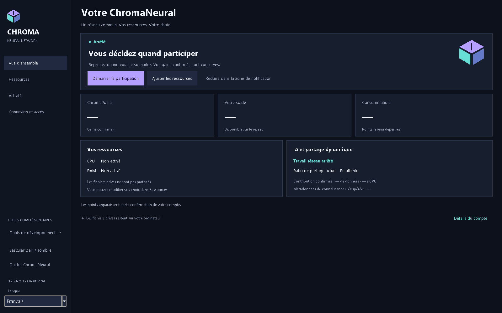
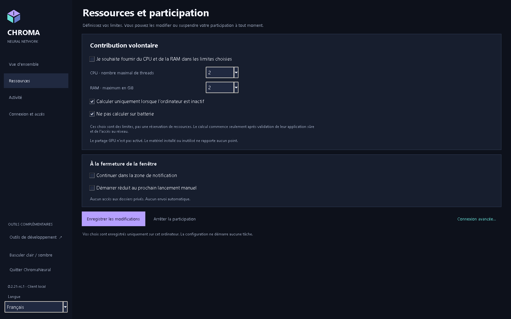
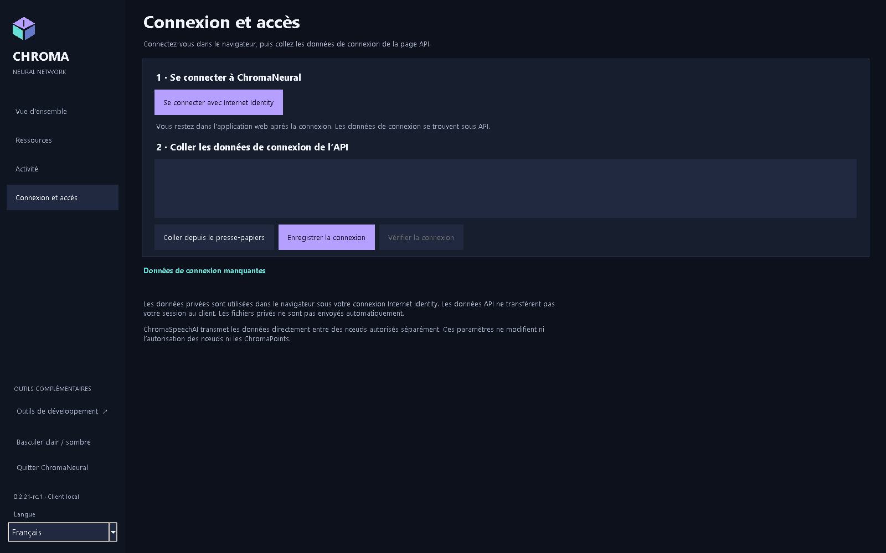
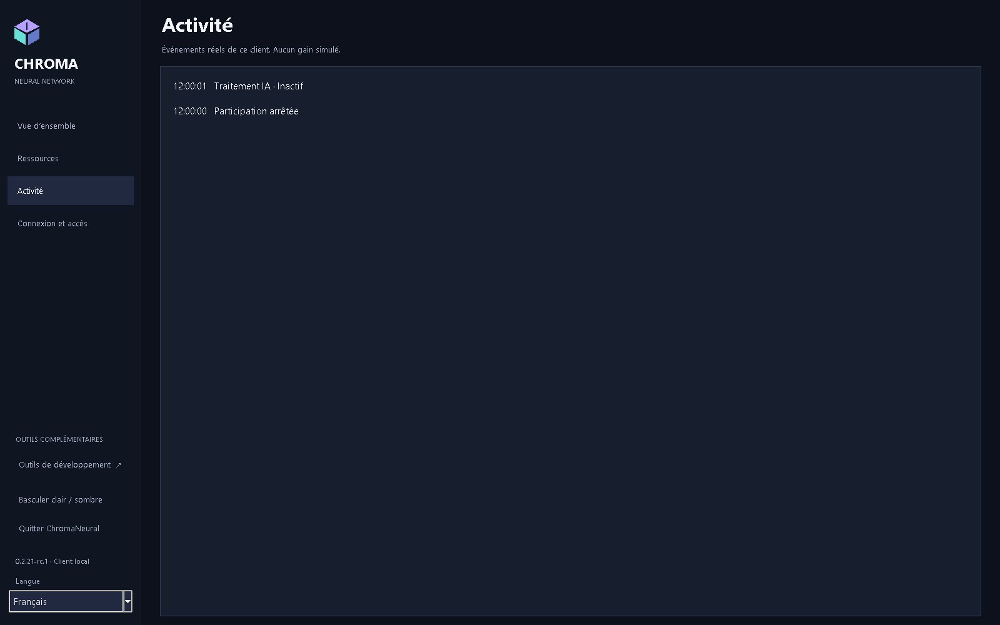

<p align="center"></p>
<p align="center"><strong>ChromaNeural 0.2.21-rc.4</strong><br>Version candidate / préversion</p>
<p align="center"><a href="RELEASE_NOTES.md">RC4</a> · <a href="INSTALLATION.md">Installation</a> · <a href="docs/README.md">Documentation et PDF anglais</a> · <a href="VERIFICATION.md">Capacités vérifiées</a> · <a href="KNOWN_LIMITATIONS.md">Limites</a></p>

# ChromaNeural

**RC4 prend en charge uniquement Windows x64 et Linux amd64.**

[English](README.md) · [Dansk](README-DK.md) · [Deutsch](README-DE.md) · [Français](README-FR.md) · [日本語](README-JA.md) · [简体中文](README-ZH-CN.md) · [हिन्दी](README-HI-IN.md)

**RC4 préversion publiée : VERIFIED/PASS.** Paquets Windows/Linux, premier démarrage sans état antérieur et validation manuelle du propriétaire réussis. [État et limites](RELEASE_NOTES.md).

**Travail d’IA local, collaboration authentifiée entre pairs et frontière claire entre travail privé et résultats partagés.**

ChromaNeural est un client de bureau et un framework logiciel pour des travaux d’IA explicitement autorisés. Il associe file locale persistante, fournisseurs d’IA locaux sélectionnables, transport authentifié ChromaSpeechAI entre pairs et publication soumise au consentement. Le profil pris en charge est la **proposition de code**, pas un système général acceptant n’importe quel travail distant.

La version historique rc.1 a fourni des logiciels testés pour **Windows, Linux et macOS**, avec des limites propres à chaque plateforme. Tests LAN réels entre deux ordinateurs, WAN direct mobile-vers-domicile et inférence locale réelle complètent les contrôles natifs des paquets. **L’admission, la migration et le parcours Internet Identity réel de bout en bout sur le réseau de production ne sont pas encore vérifiés.** Installer ne rejoint pas un réseau rémunérateur et ne déploie pas de backend.

## Ce qui distingue ChromaNeural

- **Le travail local d’abord.** Ouvrir un espace ne le téléverse pas. Un fournisseur local traite les entrées explicitement sélectionnées sur votre ordinateur.
- **La collaboration est volontaire.** Identité du pair, autorisation de tâche et consentement à divulguer le source sont distincts. Le contenu reçu reste une donnée, jamais exécutée automatiquement.
- **L’intégrité n’est pas la vérité.** Des SHA-256 égaux prouvent l’identité des octets, pas une réponse IA vérifiée ni une permission de publier.
- **L’identité a des frontières.** Votre session humaine Internet Identity reste au navigateur. Un nœud a sa propre identité de signature ; copier un Principal ne fournit pas un justificatif d’authentification.
- **Publier est une décision séparée.** Fichiers privés, résultats locaux et Shared Network Knowledge ne sont pas des stockages interchangeables. Vérification, consentement, rôles et backend s’appliquent.

Ce sont des frontières logicielles concrètes, pas une promesse d’anonymat, de chiffrement local ou de justesse universelle de l’IA. Voir [Confidentialité et stockage](docs/fr/ChromaNeural-Privacy-and-Storage.md).

## Langue du client rc.3

Un seul client prend en charge English, Dansk, Deutsch, Français, 日本語, 简体中文 et हिन्दी. L’anglais est la langue par défaut et de repli, indépendamment du système. Le sélecteur latéral change immédiatement les textes de l’application. Les saisies, le code source, le JSON de connexion et l’état de participation sont conservés ; changer de langue ne lance ni worker supplémentaire ni contrôle réseau. Les boîtes de sélection de fichiers du système gardent sa langue.

Un choix explicite dans l’interface enregistre seulement la version et la locale dans `ui-language.json`, à côté de `preferences.json`, sans changer son schéma ni créer un second répertoire d’état. Le choix revient au prochain démarrage. Une préférence absente, invalide, trop volumineuse ou non prise en charge entraîne un repli sur l’anglais sans réécrire l’original. Un enregistrement explicite ultérieur conserve un original invalide ; un échec de sauvegarde conserve la langue courante.

L’argument CLI facultatif `--language` remplace la langue pour ce lancement sans l’enregistrer. Les lanceurs Windows transmettent `-Language`. Les identifiants proviennent de `client/locale-registry.json` ; l’ensemble initial est `en`, `da`, `de`, `fr`, `ja`, `zh-CN`, `hi-IN`. Une future langue demande un catalogue avec les mêmes clés de messages et une entrée de registre contenant nom et métadonnées de format numérique. La huitième locale temporaire de test n’est pas distribuée.

## Aperçu

<p align="center">

</p>

<table>
<tr>
<td width="50%" valign="top">
<br>
<strong>Vos choix de ressources</strong><br>CPU, threads, mémoire et participation.
</td>
<td width="50%" valign="top">
<br>
<strong>Authentification navigateur, connexion client séparée</strong><br>Aucune session Internet Identity transférée au bureau.
</td>
</tr>
</table>

<details>
<summary>Activité et contexte des captures</summary>
<p align="center">

</p>
</details>

[Captures vérifiées](docs/images/rc2/README.md) · [Origine des captures](docs/SCREENSHOTS.md) · [Documentation et PDF anglais](docs/README.md).

## Ce que fait le logiciel

| Capacité | Disponibilité |
|---|---|
| Travail de fond | Tâches locales déjà autorisées dans la file persistante existante, avec baux, pause, annulation, arrêt et redémarrage. |
| Fournisseurs locaux | CPU/Qwen fourni sur Windows/Linux ; adaptateur Ollama local explicite et modèle sélectionné. Aucun repli silencieux. |
| Collaboration entre pairs | Questions/réponses approuvées corrélées à la tâche de proposition initiale via TLS et boîte SQLite existants. |
| Ressources | Le profil Windows CPU fourni contrôle ordonnancement, threads, mémoire engagée et cycle de vie. RAM physique totale non garantie. Les autres profils contrôlés fournisseur/OS sont refusés de manière sûre. |
| Résultats | Contributions locales et de pairs conservent provenance et état d’examen. Sortie non vérifiée jusqu’à acceptation par le processus faisant autorité. |
| Publication | Logiciel existant soumis au consentement, à la vérification et aux rôles testé localement. Cette préversion ne démontre pas de service public réel de résultats. |
| Connexion | Le bureau contrôle anonymement l’API publique. Connexion privée navigateur et configuration du nœud autorisée séparément sont distinctes. |

**Le partage général des ressources reste désactivé.** Préférence enregistrée ou contrôle public réussi ne prouvent ni admission, ni contribution active, ni ChromaPoints. Cette RC n’a pas de bouton général pour des problèmes arbitraires ; les opérations avancées utilisent la CLI existante.

## Parcours du travail

```text
Entrée locale + autorisations explicites
              |
       File de travail existante
              |
    Fournisseur local / échange avec pair approuvé
              |
     Résultat corrélé + contrôles d’intégrité
              |
       Examen / vérification
              |
  Publication facultative selon les règles existantes
```

Ni exécution automatique de code reçu, ni autovérification par l’IA, ni points pour simplement sauvegarder/télécharger. Le téléchargement privé direct par le demandeur avant publication globale facultative est reporté dans cette version.

## Confidentialité, stockage et navigateur

Le bureau conserve paramètres, file et journaux localement. L’espace choisi reste un dossier ordinaire sous votre contrôle. La file peut contenir source, instructions, résultats et chemins : **protégez-les comme des données privées**. L’application ne chiffre pas l’état local.

| Emplacement | Valeur par défaut |
|---|---|
| État Windows | `%LOCALAPPDATA%\ChromaNeural\client` |
| État Linux | `${XDG_STATE_HOME:-$HOME/.local/state}/chroma-neural/client` |
| Fichiers de travail | Dossier explicitement choisi ; pas de téléversement automatique intégral |
| Données privées du navigateur | Application web existante sous l’appelant Internet Identity authentifié |

`--state-dir` ou `CHROMA_STATE_DIR` sélectionnent un autre répertoire. Identité/configuration du nœud et boîtes de pairs ont leurs propres chemins explicites. [Noms exacts, conservation et frontières des sessions](docs/fr/ChromaNeural-Privacy-and-Storage.md).

**Private II storage** est informatif. Le transfert natif de fichiers privés sous autorité du propriétaire navigateur n’est pas implémenté. Utiliser le web ne transfère pas sa session au nœud. La vérification locale de confidentialité/accès ne prouve pas le déploiement des corrections sur le service réel.

## Plateformes et téléchargements RC4

| Plateforme officielle de préversion | Téléchargement | Portée vérifiée |
|---|---|---|
| Windows x64 | [EXE Windows](RELEASE_NOTES.md) | Installation native propre, SDK/CLI/Tk, intégrité et acceptation manuelle GUI Windows |
| Linux amd64 | [Paquet Debian](RELEASE_NOTES.md) | Compilation Ubuntu 24.04 native, extraction, SDK/CLI, Xvfb/Tk ; pas le cycle complet installation/suppression |
| Source | [ZIP source accepté](RELEASE_NOTES.md) | Source accepté de la publication ; documentation actuelle potentiellement plus récente |

**Prérequis :** Windows : Python 3.14 avec Tk et `py`/`pyw`, Node.js 24. Linux : Python 3.11+, Tk, cryptography, Node.js 20+, libgomp1.  Lisez [Installation](INSTALLATION.md) avant de télécharger.

Paquets **non signés**. Des avertissements système sont possibles. Voir [État des éléments visuels](docs/BRANDING.md).


### Vérifier le téléchargement

Téléchargez [SHA256SUMS.txt](RELEASE_NOTES.md) avec le paquet. Windows : `Get-FileHash -Algorithm SHA256` ; Linux : `sha256sum`. Comparez la valeur entière du nom exact. SHA-256 vérifie les octets, pas l’éditeur. [Empreintes et commandes publiées](docs/DOWNLOADS.md).

GitHub a changé le nom DEB de `~rc.1` en `.rc.1` ; octets et empreinte restent identiques.

## Documentation

La base documentaire rc.2 conservée est VERIFIED/PASS : 35 PDF dans sept langues, 195 pages examinées visuellement, polices incorporées/sous-ensembles et extraction Unicode hindi vérifiée. Les [PDF vérifiés](docs/pdf/rc2/README.md) et [28 captures vérifiées](docs/images/rc2/README.md) conservent leur provenance. Les liens PDF rc.1 ci-dessous sont historiques. MCP est décrit dans le complément dédié.

| Guide | Markdown | PDF anglais historique rc.1 |
|---|---|---|
| Présentation | [Système et déroulement](docs/fr/ChromaNeural-Overview.md) | [Présentation](docs/pdf/ChromaNeural-Overview.pdf) |
| Utilisation | [Utiliser le client](docs/fr/ChromaNeural-User-Guide.md) | [Utilisation](docs/pdf/ChromaNeural-User-Guide.pdf) |
| Confidentialité et stockage | [Données, chemins, identité](docs/fr/ChromaNeural-Privacy-and-Storage.md) | [Confidentialité et stockage](docs/pdf/ChromaNeural-Privacy-and-Storage.pdf) |
| Installation | [Windows, Linux](INSTALLATION.md) | [Installation](docs/pdf/ChromaNeural-Installation.pdf) |
| Capacités vérifiées | [Preuves et limites](docs/fr/ChromaNeural-Verified-Capabilities.md) | [Capacités vérifiées](docs/pdf/ChromaNeural-Verified-Capabilities.pdf) |

Développeurs : [reproduction et preuves](VERIFICATION.md), [contribuer](CONTRIBUTING.md), [modifications](CHANGELOG.md), [frontières de licences](docs/LICENSING.md).

## Hors acceptation

Internet Identity réel de bout en bout, admission et migration restent **NON VÉRIFIÉS**. Intégration native de fichiers privés et accès direct du propriétaire aux résultats ne sont pas livrés. Contribution contrôlée hors profil Windows documenté non prise en charge. Initiation WAN inverse limitée par l’environnement. Voir [toutes les limites](KNOWN_LIMITATIONS.md).

C’est une **documentation logicielle**. Transport LAN/WAN réel et inférence réelle sont distingués des tests locaux/simulés. Aucune performance GPU, optique ou spécialisée n’est revendiquée comme physiquement vérifiée.

Dans rc.3, ChromaSpeechAI reste nœud-à-nœud ; MCP facultatif est nœud-à-outil. ChromaNeural fonctionne sans MCP. Les connexions et chaque outil nécessitent une approbation explicite.

## Code ouvert et contributions

Code et documentation propres à ChromaNeural : **Apache License 2.0**. Les quatre fichiers Refract Editor documentés restent **MIT**, comme les composants ChromaPlex/CPL/CPA et ChromaSpeechAI identifiés. **PRISME conserve ses conditions restrictives séparées et n’est pas relicencié.** Les dépendances conservent leurs notices. Voir [LICENSE](LICENSE), [NOTICE](NOTICE), [THIRD_PARTY_LICENSES.md](THIRD_PARTY_LICENSES.md) et [périmètre exact](docs/LICENSING.md).

Signalements, améliorations documentaires et contributions compatibles sont bienvenus. Suivez [CONTRIBUTING.md](CONTRIBUTING.md) ; ne joignez ni identités privées, ni bases de file, ni sessions, ni journaux bruts. Signalez la sécurité selon [SECURITY.md](SECURITY.md).


MCP et configuration intégrée IA/outils : VERIFIED/PASS. Le vrai modèle `qwen3:4b-instruct` avec Ollama 0.35.1 a appelé un outil MCP contrôlé et approuvé, reçu son résultat exact dans la requête d’inférence suivante et utilisé ce résultat dans sa réponse finale. L’inférence ordinaire avec MCP désactivé ou indisponible a également réussi. Cela ne certifie pas tous les modèles ou services externes. Voir [MCP et configuration (anglais)](docs/MCP_ONBOARDING.md).
