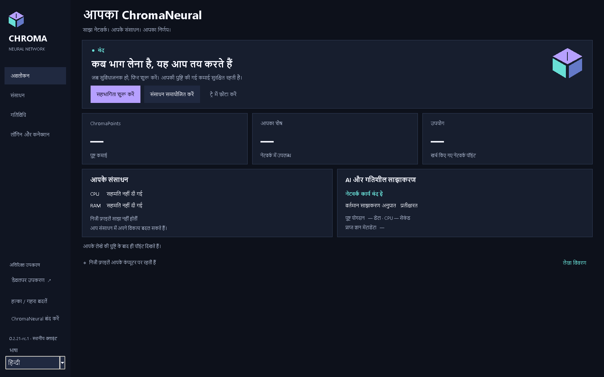
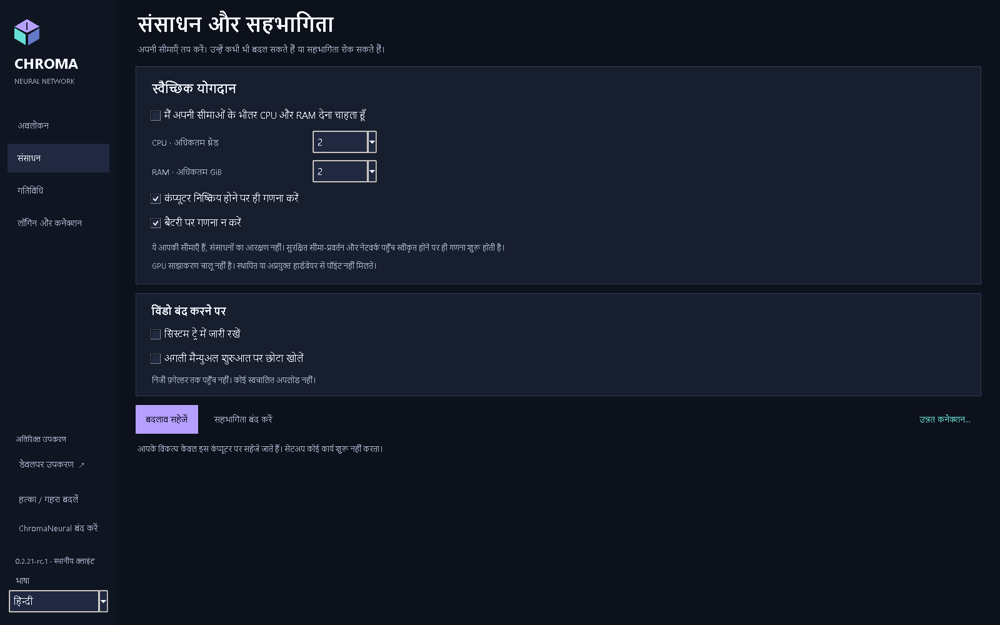
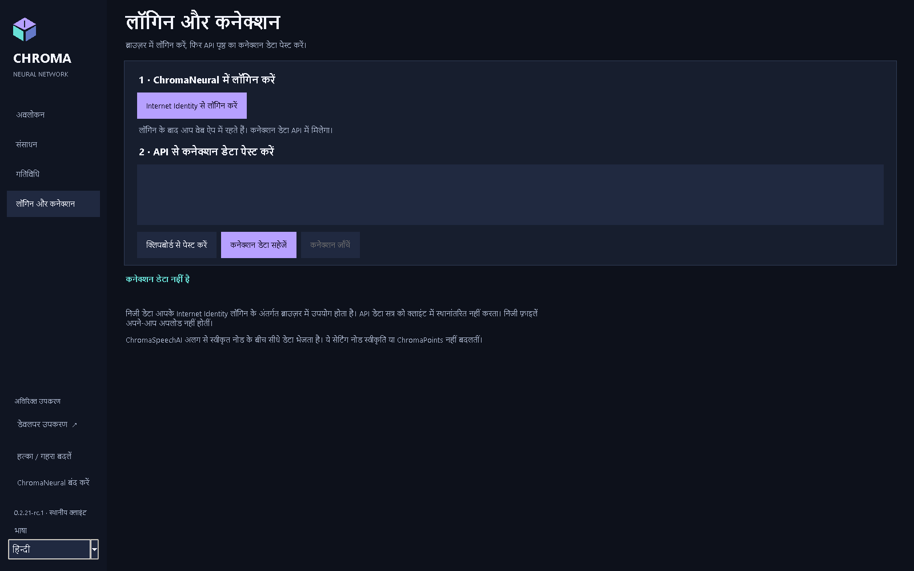
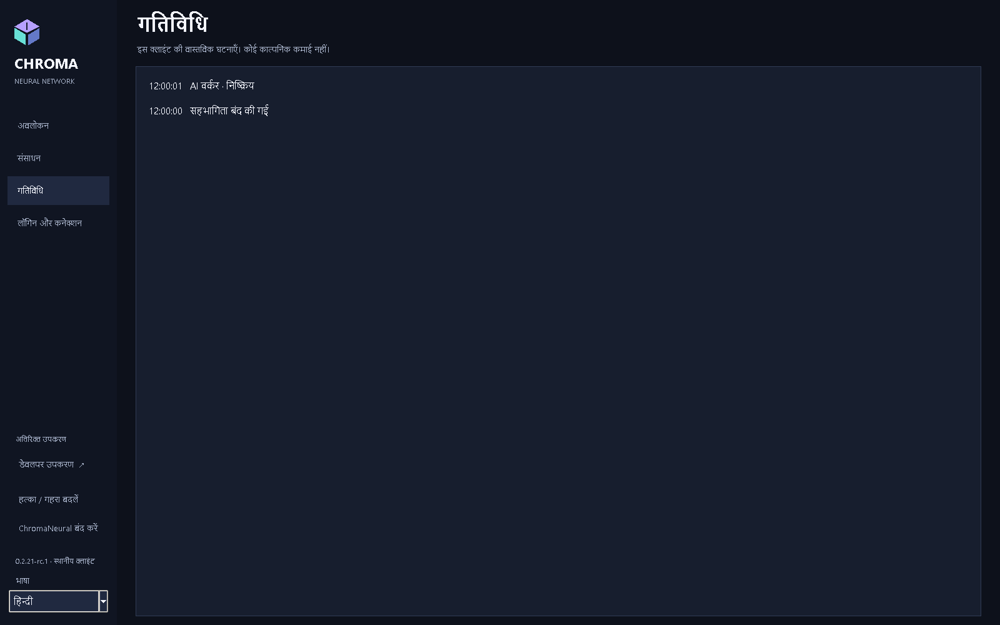

<p align="center"></p>
<p align="center"><strong>ChromaNeural 0.2.21-rc.4</strong><br>रिलीज़ उम्मीदवार / प्रीरिलीज़</p>
<p align="center"><a href="RELEASE_NOTES.md">RC4</a> · <a href="INSTALLATION.md">स्थापना</a> · <a href="docs/README.md">दस्तावेज़ और अंग्रेज़ी PDF</a> · <a href="VERIFICATION.md">सत्यापित क्षमताएँ</a> · <a href="KNOWN_LIMITATIONS.md">सीमाएँ</a></p>

# ChromaNeural

**RC4 केवल Windows x64 और Linux amd64 का समर्थन करता है।**

[English](README.md) · [Dansk](README-DK.md) · [Deutsch](README-DE.md) · [Français](README-FR.md) · [日本語](README-JA.md) · [简体中文](README-ZH-CN.md) · [हिन्दी](README-HI-IN.md)

**RC4 प्रकाशित प्रीरिलीज़: VERIFIED/PASS।** Windows/Linux पैकेज, साफ़ स्थिति में पहली शुरुआत और स्वामी की मैन्युअल जाँच सफल हैं। [स्थिति और सीमाएँ](RELEASE_NOTES.md)।

**स्थानीय AI काम, प्रमाणित साथी सहयोग, और निजी काम व साझा परिणामों के बीच स्पष्ट सीमा।**

ChromaNeural स्पष्ट स्वीकृत AI कार्य का डेस्कटॉप क्लाइंट और सॉफ़्टवेयर ढाँचा है। इसमें स्थायी स्थानीय कतार, चुने जाने वाले स्थानीय AI प्रदाता, प्रमाणित ChromaSpeechAI साथी परिवहन और सहमति-नियंत्रित प्रकाशन हैं। समर्थित सहयोग **कोड प्रस्ताव** है, मनमाना दूरस्थ काम लेने वाला सामान्य तंत्र नहीं।

पुराने rc.1 ने **Windows, Linux, macOS** के लिए उनकी सीमाओं में परीक्षण किया सॉफ़्टवेयर दिया। असली दो-कंप्यूटर LAN, मोबाइल से घर का सीधा WAN और वास्तविक स्थानीय मॉडल अनुमान मूल पैकेज जाँच पूरक हैं। **उत्पादन नेटवर्क का लाइव प्रवेश, माइग्रेशन और Internet Identity का पूरा प्रवाह अभी असत्यापित है।** स्थापना कमाई नेटवर्क में प्रवेश या बैकएंड तैनात नहीं करती।

## ChromaNeural की विशेषताएँ

- **शुरुआत स्थानीय काम से।** कार्यक्षेत्र खोलना अपलोड नहीं है। स्थानीय प्रदाता स्पष्ट चुना इनपुट आपके कंप्यूटर पर संसाधित करता है।
- **सहयोग सोच-समझकर।** साथी पहचान, काम की स्वीकृति और स्रोत खुलासे की सहमति अलग हैं। मिली सामग्री डेटा रहती है, स्वतः नहीं चलती।
- **अखंडता सत्य नहीं है।** समान SHA-256 समान बाइट बताते हैं, सत्यापित AI उत्तर या प्रकाशन अनुमति नहीं।
- **पहचान की सीमाएँ हैं।** मानव Internet Identity सत्र ब्राउज़र में रहता है। नोड की अपनी हस्ताक्षर पहचान है; कॉपी Principal प्रमाणीकरण प्रमाण नहीं।
- **प्रकाशन अलग निर्णय है।** निजी फ़ाइलें, स्थानीय परिणाम और Shared Network Knowledge परस्पर बदलने योग्य संग्रह नहीं। सत्यापन, सहमति, भूमिका और बैकएंड स्वीकृति लागू हैं।

ये सॉफ़्टवेयर सीमाएँ हैं, गुमनामी, एन्क्रिप्टेड स्थानीय संग्रह या हमेशा सही AI का वादा नहीं। [गोपनीयता और संग्रह](docs/hi-IN/ChromaNeural-Privacy-and-Storage.md) देखें।

## rc.3 क्लाइंट की भाषा

एक ही क्लाइंट English, Dansk, Deutsch, Français, 日本語, 简体中文 और हिन्दी देता है। OS की भाषा चाहे जो हो, अंग्रेज़ी डिफ़ॉल्ट और फ़ॉलबैक है। साइडबार चयन से ऐप के अपने पाठ तुरंत बदलते हैं। मौजूदा इनपुट, स्रोत पाठ, कनेक्शन JSON और भागीदारी स्थिति बनी रहती है; भाषा बदलने से दूसरा वर्कर या नेटवर्क जाँच शुरू नहीं होती। OS के फ़ाइल चयन नियंत्रण OS की भाषा रखते हैं।

GUI में स्पष्ट चयन केवल संस्करण और लोकेल को मौजूदा `preferences.json` के पास `ui-language.json` में सहेजता है। पुराने स्कीमा में बदलाव या दूसरा स्थिति-स्थान नहीं बनता। अगली शुरुआत में चयन लौटता है। अनुपस्थित, अमान्य, बहुत बड़ी या असमर्थित पसंद पर मूल फ़ाइल बदले बिना अंग्रेज़ी मिलती है। बाद में स्पष्ट सहेजना अमान्य मूल को सुरक्षित रखता है; सहेजने में विफलता पर वर्तमान भाषा बनी रहती है।

वैकल्पिक CLI `--language` सिर्फ उस बार भाषा बदलता है, सहेजता नहीं। Windows लॉन्चर `-Language` आगे देते हैं। समर्थित पहचान `client/locale-registry.json` से आती हैं; शुरुआती सेट `en`, `da`, `de`, `fr`, `ja`, `zh-CN`, `hi-IN` है। नई भाषा को समान संदेश कुंजियों वाला एक कैटलॉग और नाम तथा संख्या-प्रारूप मेटाडेटा वाली एक रजिस्ट्री प्रविष्टि चाहिए। अस्थायी आठवीं परीक्षण भाषा वितरित नहीं होती।

## अंदर की झलक

<p align="center">

</p>

<table>
<tr>
<td width="50%" valign="top">
<br>
<strong>आपके संसाधन विकल्प</strong><br>CPU, थ्रेड, मेमोरी और भागीदारी।
</td>
<td width="50%" valign="top">
<br>
<strong>ब्राउज़र लॉगिन, अलग क्लाइंट कनेक्शन</strong><br>Internet Identity सत्र डेस्कटॉप को नहीं भेजा जाता।
</td>
</tr>
</table>

<details>
<summary>गतिविधि और चित्रों का संदर्भ</summary>
<p align="center">

</p>
</details>

[सत्यापित स्क्रीनशॉट](docs/images/rc2/README.md) · [चित्रों का स्रोत](docs/SCREENSHOTS.md) · [दस्तावेज़ और अंग्रेज़ी PDF](docs/README.md).

## सॉफ़्टवेयर क्या करता है

| क्षमता | उपलब्ध दायरा |
|---|---|
| पृष्ठभूमि काम | पहले स्वीकृत स्थानीय काम मौजूदा स्थायी कतार में लीज़, विराम, रद्द, रोक, पुनः आरंभ सहित। |
| स्थानीय AI | Windows/Linux में CPU/Qwen; स्पष्ट स्थानीय Ollama अडैप्टर और मॉडल। छिपा फ़ॉलबैक नहीं।  |
| साथी सहयोग | स्वीकृत प्रश्न/उत्तर मौजूदा TLS और SQLite इनबॉक्स से मूल कोड प्रस्ताव कार्य से जुड़े रहते हैं। |
| संसाधन नियंत्रण | वर्णित Windows CPU प्रोफ़ाइल CPU शेड्यूलिंग, अनुमान थ्रेड, प्रतिबद्ध मेमोरी और जीवनचक्र नियंत्रित करती है। कुल भौतिक RAM गारंटी नहीं। अन्य नियंत्रित प्रदाता/OS प्रोफ़ाइल सुरक्षित रूप से अस्वीकार होती हैं। |
| परिणाम | स्थानीय/साथी मूल और समीक्षा स्थिति बनी रहती है। मौजूदा प्रामाणिक सत्यापन स्वीकारने तक असत्यापित। |
| प्रकाशन | मौजूदा सहमति, सत्यापन और भूमिका वाला सॉफ़्टवेयर स्थानीय परीक्षण किया गया। यह पूर्व-रिलीज़ लाइव सार्वजनिक परिणाम सेवा सिद्ध नहीं करती। |
| कनेक्शन | डेस्कटॉप सार्वजनिक API अनाम रूप से जाँचता है। निजी ब्राउज़र लॉगिन और अलग अधिकृत नोड सेटअप अलग कार्य हैं। |

**सामान्य संसाधन साझाकरण बंद है।** सहेजी पसंद या सफल सार्वजनिक जाँच से प्रवेश, सक्रिय योगदान या ChromaPoints सिद्ध नहीं। इस RC में मनमानी समस्या भेजने का सामान्य बटन नहीं; उन्नत कतार/सहयोग मौजूदा CLI से हैं।

## काम का रास्ता

```text
स्थानीय इनपुट + स्पष्ट स्वीकृतियाँ
              |
       मौजूदा काम कतार
              |
    स्थानीय प्रदाता / स्वीकृत साथी आदान-प्रदान
              |
     जुड़ा परिणाम + अखंडता जाँच
              |
       समीक्षा / सत्यापन
              |
  मौजूदा नियमों के तहत वैकल्पिक प्रकाशन
```

साथी कोड स्वतः नहीं चलता, AI स्वयं सत्यापन नहीं करता, केवल सहेजने/डाउनलोड पर अंक नहीं। वैश्विक प्रकाशन से पहले अनुरोधकर्ता का सीधा निजी डाउनलोड इस संस्करण में स्थगित है।

## गोपनीयता, संग्रह और ब्राउज़र

डेस्कटॉप सेटिंग, कतार और लॉग स्थानीय रखता है। कार्यक्षेत्र आपके नियंत्रण का सामान्य फ़ोल्डर है। कतार में स्रोत, निर्देश, परिणाम और पथ हो सकते हैं: **निजी डेटा की तरह बचाएँ**। ऐप स्थानीय स्थिति एन्क्रिप्ट नहीं करता।

| स्थान | डिफ़ॉल्ट |
|---|---|
| Windows स्थिति | `%LOCALAPPDATA%\ChromaNeural\client` |
| Linux स्थिति | `${XDG_STATE_HOME:-$HOME/.local/state}/chroma-neural/client` |
| काम की फ़ाइलें | स्पष्ट चुना फ़ोल्डर, पूरे फ़ोल्डर का स्वतः अपलोड नहीं |
| ब्राउज़र का निजी डेटा | प्रमाणित Internet Identity कॉलर के तहत मौजूदा वेब ऐप |

`--state-dir` या `CHROMA_STATE_DIR` दूसरा स्थिति स्थान चुन सकते हैं। नोड पहचान/कॉन्फ़िगरेशन और साथी इनबॉक्स के अपने स्पष्ट पथ हैं। [सटीक नाम, संरक्षण और सत्र सीमाएँ](docs/hi-IN/ChromaNeural-Privacy-and-Storage.md)।

**Private II storage** सूचनात्मक है। ब्राउज़र स्वामी अधिकार से मूल निजी अपलोड/डाउनलोड नहीं बना। वेब ऐप उपयोग उसका सत्र नोड को नहीं देता। स्थानीय गोपनीयता/पहुँच जाँच लाइव सेवा पर सुधार तैनाती सिद्ध नहीं करती।

## RC4 प्लेटफ़ॉर्म और डाउनलोड

| आधिकारिक पूर्व-रिलीज़ प्लेटफ़ॉर्म | डाउनलोड | सत्यापित दायरा |
|---|---|---|
| Windows x64 | [Windows EXE](RELEASE_NOTES.md) | मूल साफ़ स्थापना, SDK/CLI/Tk, अखंडता, मैनुअल Windows GUI |
| Linux amd64 | [Debian पैकेज](RELEASE_NOTES.md) | मूल Ubuntu 24.04 बिल्ड, खोलना, SDK/CLI, Xvfb/Tk; पूरा स्थापना/हटाना नहीं |
| स्रोत | [स्वीकृत स्रोत ZIP](RELEASE_NOTES.md) | स्वीकृत रिलीज़ स्रोत; वर्तमान दस्तावेज़ नया हो सकता है |

**ज़रूरतें:** Windows: Python 3.14/Tk, `py`/`pyw`, Node.js 24। Linux: Python 3.11+, Tk, cryptography, Node.js 20+, libgomp1।  डाउनलोड से पहले [स्थापना](INSTALLATION.md) पढ़ें।

पैकेज **अहस्ताक्षरित** हैं। OS चेतावनी आ सकती है। [ब्रांड स्थिति](docs/BRANDING.md) देखें।


### डाउनलोड सत्यापित करें

पैकेज के साथ [SHA256SUMS.txt](RELEASE_NOTES.md) लें। Windows: `Get-FileHash -Algorithm SHA256`; Linux: `sha256sum`। सटीक नाम की पूरी राशि मिलाएँ। SHA-256 बाइट जाँचता है, प्रकाशक पहचान नहीं। [सभी प्रकाशित हैश और आदेश](docs/DOWNLOADS.md)।

GitHub ने DEB नाम `~rc.1` से `.rc.1` किया; बाइट और सामग्री हैश नहीं बदले।

## दस्तावेज़

संरक्षित rc.2 दस्तावेज़ आधार VERIFIED/PASS है: सात भाषाओं में 35 PDF, 195 पृष्ठों की दृश्य समीक्षा, फ़ॉन्ट एम्बेडिंग/सबसेट और हिन्दी Unicode निष्कर्षण सत्यापित हैं। [सत्यापित PDF](docs/pdf/rc2/README.md) और [28 सत्यापित स्क्रीनशॉट](docs/images/rc2/README.md) का मूल स्रोत विवरण सुरक्षित है। नीचे rc.1 PDF लिंक ऐतिहासिक हैं। MCP अलग पूरक दस्तावेज़ में वर्णित है।

| मार्गदर्शिका | Markdown | पुराना अंग्रेज़ी rc.1 PDF |
|---|---|---|
| अवलोकन | [प्रणाली और प्रवाह](docs/hi-IN/ChromaNeural-Overview.md) | [अवलोकन](docs/pdf/ChromaNeural-Overview.pdf) |
| उपयोगकर्ता | [क्लाइंट उपयोग](docs/hi-IN/ChromaNeural-User-Guide.md) | [उपयोगकर्ता](docs/pdf/ChromaNeural-User-Guide.pdf) |
| गोपनीयता और संग्रह | [डेटा, पथ, पहचान](docs/hi-IN/ChromaNeural-Privacy-and-Storage.md) | [गोपनीयता और संग्रह](docs/pdf/ChromaNeural-Privacy-and-Storage.pdf) |
| स्थापना | [Windows, Linux](INSTALLATION.md) | [स्थापना](docs/pdf/ChromaNeural-Installation.pdf) |
| सत्यापित क्षमताएँ | [प्रमाण और सीमाएँ](docs/hi-IN/ChromaNeural-Verified-Capabilities.md) | [सत्यापित क्षमताएँ](docs/pdf/ChromaNeural-Verified-Capabilities.pdf) |

विकासकर्ता: [पुनरुत्पादन और प्रमाण](VERIFICATION.md), [योगदान](CONTRIBUTING.md), [बदलाव](CHANGELOG.md), [लाइसेंस सीमाएँ](docs/LICENSING.md)।

## स्वीकृति से बाहर

वास्तविक लाइव Internet Identity पूर्ण प्रवाह, प्रवेश, माइग्रेशन **असत्यापित** हैं। मूल निजी फ़ाइल एकीकरण और सीधे निजी स्वामी परिणाम उपलब्ध नहीं। वर्णित Windows के बाहर नियंत्रित योगदान असमर्थित। उलटी WAN शुरुआत परीक्षण वातावरण से सीमित थी। [सभी ज्ञात सीमाएँ](KNOWN_LIMITATIONS.md) देखें।

यह **सॉफ़्टवेयर दस्तावेज़** है। असली LAN/WAN और अनुमान को स्थानीय/मॉक से अलग बताया गया है। विशेष GPU, ऑप्टिकल या अन्य हार्डवेयर प्रदर्शन को भौतिक सत्यापित नहीं कहा गया।

rc.3 में ChromaSpeechAI नोड से नोड संचार के लिए है; वैकल्पिक MCP नोड से टूल संचार के लिए है। ChromaNeural बिना MCP के भी काम करता है। हर कनेक्शन और टूल के लिए स्पष्ट अनुमति आवश्यक है।

## मुक्त स्रोत और योगदान

ChromaNeural का अपना कोड/दस्तावेज़ **Apache License 2.0** है। चार लिखित Refract Editor फ़ाइलें तथा निर्दिष्ट ChromaPlex/CPL/CPA, ChromaSpeechAI घटक **MIT** रहते हैं। **PRISME की अलग प्रतिबंधात्मक शर्तें बनी रहती हैं; यहाँ पुनः लाइसेंस नहीं होता।** अन्य निर्भरताओं की सूचनाएँ बनी हैं। [LICENSE](LICENSE), [NOTICE](NOTICE), [THIRD_PARTY_LICENSES.md](THIRD_PARTY_LICENSES.md), [सटीक दायरा](docs/LICENSING.md) पढ़ें।

समस्या, दस्तावेज़ सुधार और संगत योगदान स्वागत योग्य हैं। [CONTRIBUTING.md](CONTRIBUTING.md) मानें; निजी पहचान, कतार डेटाबेस, सत्र या कच्चे लॉग न लगाएँ। सुरक्षा समस्या [SECURITY.md](SECURITY.md) से रिपोर्ट करें।


MCP और एकीकृत AI/टूल सेटअप: VERIFIED/PASS। Ollama 0.35.1 पर वास्तविक `qwen3:4b-instruct` मॉडल ने एक अनुमोदित नियंत्रित MCP टूल को एक बार बुलाया, अगली अनुमान अनुरोध में उसका बिल्कुल सही परिणाम पाया और अंतिम उत्तर में उसका उपयोग किया। MCP अक्षम या अनुपलब्ध होने पर सामान्य अनुमान भी सफल रहा। इससे हर मॉडल या बाहरी सेवा प्रमाणित नहीं होती। [MCP और सेटअप (अंग्रेज़ी)](docs/MCP_ONBOARDING.md) देखें।
