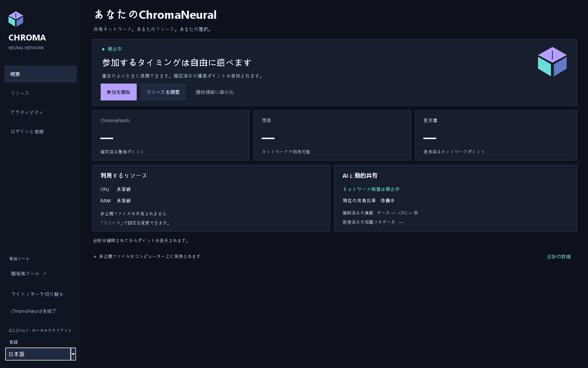
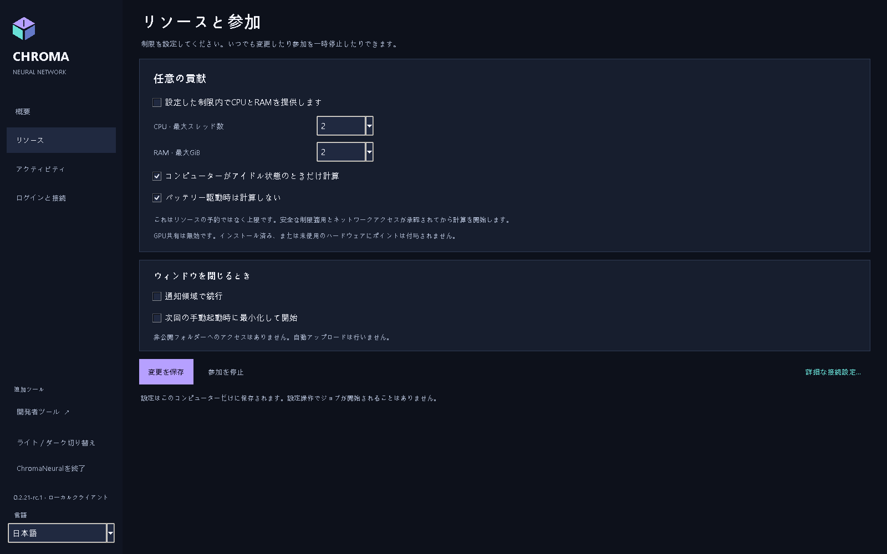
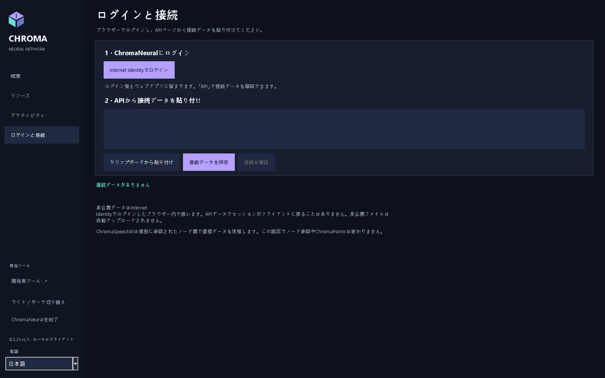
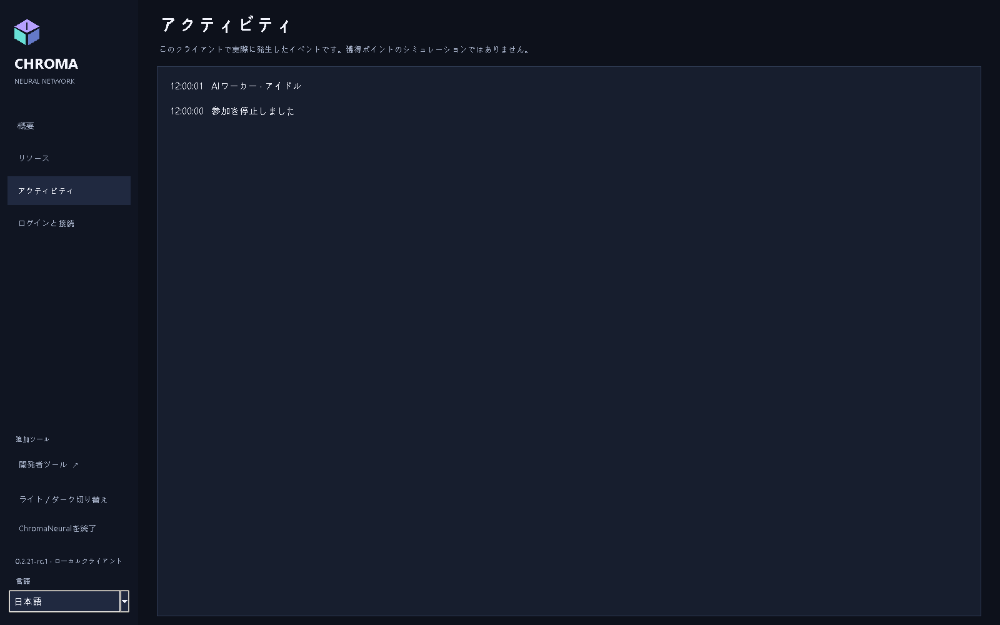

<p align="center"></p>
<p align="center"><strong>ChromaNeural 0.2.21-rc.4</strong><br>リリース候補 / プレリリース</p>
<p align="center"><a href="RELEASE_NOTES.md">RC4</a> · <a href="INSTALLATION.md">インストール</a> · <a href="docs/README.md">文書と英語 PDF</a> · <a href="VERIFICATION.md">検証済み機能</a> · <a href="KNOWN_LIMITATIONS.md">制約</a></p>

# ChromaNeural

**RC4の対応プラットフォームはWindows x64とLinux amd64のみです。**

[English](README.md) · [Dansk](README-DK.md) · [Deutsch](README-DE.md) · [Français](README-FR.md) · [日本語](README-JA.md) · [简体中文](README-ZH-CN.md) · [हिन्दी](README-HI-IN.md)

**RC4公開プレリリース：VERIFIED/PASS。** Windows/Linuxパッケージ、初回のクリーン起動、所有者による手動確認に合格しました。[状態と制限](RELEASE_NOTES.md)。

**ローカル AI 作業、認証されたピア協働、私的作業と共有結果の明確な境界。**

ChromaNeural は明示的に承認した AI 作業のデスクトップクライアント／ソフトウェア基盤です。永続ローカルキュー、選択可能なローカル AI、認証済み ChromaSpeechAI ピア通信、同意に基づく結果公開を組み合わせます。対応協働は**コード提案**であり、任意の遠隔作業を受け入れる汎用システムではありません。

過去の rc.1 は **Windows、Linux、macOS** 用の検証済みソフトウェアを各 OS の制約付きで提供しました。実機2台 LAN、携帯から自宅への直接 WAN、実ローカル推論がネイティブパッケージ確認を補います。**本番ネットワークの実参加承認、移行、Internet Identity の全工程は未検証です。** 導入だけで収益ネットワークへ参加したりバックエンドを配備したりしません。

## ChromaNeural の特徴

- **ローカル作業が出発点。** 作業領域を開いてもアップロードしません。明示選択した入力をローカルプロバイダーがコンピューター上で処理します。
- **協働は意図的な選択。** ピア ID、ジョブ承認、ソース開示同意は別です。受信内容はデータのままで自動実行しません。
- **完全性は真実性ではありません。** SHA-256 一致はバイト同一性を示すだけで、AI 回答の検証や公開許可にはなりません。
- **識別には境界があります。** 人の Internet Identity セッションはブラウザーに残り、ノードは別の署名 ID を持ちます。Principal のコピーは認証資格ではありません。
- **公開は別の判断。** 私的ファイル、ローカル結果、Shared Network Knowledge は相互交換可能な保存場所ではありません。検証、同意、役割、バックエンド受理が必要です。

これは具体的なソフトウェア境界で、匿名性、ローカル暗号化、AI の普遍的正しさを約束しません。[プライバシーと保存](docs/ja/ChromaNeural-Privacy-and-Storage.md)を参照してください。

## rc.3 クライアントの言語

単一クライアントが English、Dansk、Deutsch、Français、日本語、简体中文、हिन्दी に対応します。OS の言語にかかわらず、既定とフォールバックは英語です。サイドバーの言語選択でアプリ自身の表示を即座に変更できます。入力、ソーステキスト、接続 JSON、参加状態は維持され、言語変更で別のワーカーやネットワーク確認は開始しません。OS のファイル選択部品は OS の言語のままです。

GUI で明示的に選択すると、既存の `preferences.json` と同じ状態ディレクトリの `ui-language.json` にバージョンとロケールだけを保存します。既存設定のスキーマは変えず、別の状態ルートも作りません。次回起動時に選択が復元されます。設定がない、不正、大きすぎる、未対応の場合は、原本を書き換えず英語になります。後の明示的な保存では不正な原本を保全し、保存失敗時は現在の言語を維持します。

任意の CLI 引数 `--language` は、その起動だけの上書きで保存されません。Windows ランチャーは `-Language` を渡します。対応識別子は `client/locale-registry.json` で管理し、初期出荷対象は `en`、`da`、`de`、`fr`、`ja`、`zh-CN`、`hi-IN` です。将来の言語追加に必要なのは、同じメッセージキーを持つカタログと、表示名・数値書式メタデータを含む登録項目一つです。検証用の一時的な第8ロケールは出荷しません。

## 画面を見る

<p align="center">

</p>

<table>
<tr>
<td width="50%" valign="top">
<br>
<strong>利用者によるリソース選択</strong><br>CPU、スレッド、メモリー、参加設定。
</td>
<td width="50%" valign="top">
<br>
<strong>ブラウザーログインとクライアント接続は別</strong><br>Internet Identity セッションはデスクトップに転送しません。
</td>
</tr>
</table>

<details>
<summary>アクティビティと撮影条件</summary>
<p align="center">

</p>
</details>

[検証済みの撮影記録](docs/images/rc2/README.md) · [撮影の出典](docs/SCREENSHOTS.md) · [文書と英語 PDF](docs/README.md).

## ソフトウェアが行うこと

| 機能 | 提供範囲 |
|---|---|
| 背景作業 | 承認済みローカルジョブを既存永続キューで実行。リース、一時停止、取消、停止、再起動に対応。 |
| ローカル AI | Windows/Linux に CPU/Qwen 同梱。ローカル Ollama とモデルは明示選択。無断フォールバックなし。 |
| ピア協働 | 承認済み質問・回答を元のコード提案タスクに関連付け、既存 TLS と SQLite 受信箱を使用。 |
| リソース制御 | 記載された Windows CPU プロファイルで CPU スケジューリング、推論スレッド、コミットメモリー、ライフサイクルを制御。物理 RAM 全体は保証せず、他の制御プロファイルは安全側で拒否。 |
| 結果 | ローカル／ピア由来とレビュー状態を維持。既存の権威ある検証が受理するまで未検証。 |
| 公開 | 同意、検証、役割を守る既存ソフトウェアはローカル試験済み。実稼働の公開結果サービスはこの先行版では証明しない。 |
| 接続 | 公開 API を匿名確認。私的ブラウザーログイン、別途認可されるノード設定とは別操作。 |

**一般リソース共有は無効です。** 設定保存や公開接続成功は参加承認、実貢献、ChromaPoints の証拠ではありません。任意問題の汎用投入ボタンはなく、高度なキュー／協働操作は既存 CLI を使います。

## 作業の流れ

```text
ローカル入力 + 明示承認
              |
       既存作業キュー
              |
    ローカルプロバイダー / 承認済みピア交換
              |
     対応付けされた結果 + 完全性確認
              |
       レビュー / 検証
              |
  既存規則に従う任意公開
```

受信コードの自動実行、AI 自身の自己検証、保存／取得だけでのポイント付与はありません。全体公開前に依頼者が直接私的取得する機能はこの版では延期です。

## プライバシー、保存、ブラウザー

設定、キュー、ログはローカルに保存します。選んだ作業領域は利用者管理の通常フォルダーです。キューはソース、指示、結果、ローカルパスを含み得るので、**私的データとして保護してください**。アプリはローカル状態を暗号化しません。

| 場所 | 既定 |
|---|---|
| Windows 状態 | `%LOCALAPPDATA%\ChromaNeural\client` |
| Linux 状態 | `${XDG_STATE_HOME:-$HOME/.local/state}/chroma-neural/client` |
| 作業ファイル | 明示選択フォルダー。全フォルダー自動送信なし |
| ブラウザーの私的データ | 認証済み Internet Identity 呼出元による既存 Web アプリ |

`--state-dir` または `CHROMA_STATE_DIR` で変更できます。ノード ID／設定とピア受信箱には独自の指定パスがあります。[ファイル名、保持、セッション境界](docs/ja/ChromaNeural-Privacy-and-Storage.md)。

**Private II storage** は情報表示のみです。ブラウザー所有者権限のネイティブ私的転送は未実装です。Web 利用でセッションをノードに渡しません。ローカルプライバシー／アクセス保護検証は、本番への修正配備を証明しません。

## RC4のプラットフォームとダウンロード

| 公式先行版対象 | 取得 | 検証範囲 |
|---|---|---|
| Windows x64 | [Windows EXE](RELEASE_NOTES.md) | ネイティブのクリーン導入、SDK/CLI/Tk、完全性、人による GUI 受け入れ |
| Linux amd64 | [Debian パッケージ](RELEASE_NOTES.md) | Ubuntu 24.04 ビルド、展開、SDK/CLI、Xvfb/Tk。全導入／削除ではない |
| ソース | [受け入れ済みソース ZIP](RELEASE_NOTES.md) | 受け入れ時のソース。現在文書の方が新しい場合あり |

**前提条件：** Windows は Python 3.14/Tk、`py`/`pyw`、Node.js 24。Linux は Python 3.11+、Tk、cryptography、Node.js 20+、libgomp1。[導入手順](INSTALLATION.md)を取得前に読んでください。

パッケージは**未署名**です。OSの警告が出る場合があります。[ブランド表示状態](docs/BRANDING.md)を参照してください。


### ダウンロード確認

[SHA256SUMS.txt](RELEASE_NOTES.md) も取得します。Windows は `Get-FileHash -Algorithm SHA256`、Linux は `sha256sum`。正確なファイル名の全値を比較してください。SHA-256 はバイトを検証し、発行者 ID は検証しません。[公開ハッシュとコマンド](docs/DOWNLOADS.md)。

GitHub が DEB 名を `~rc.1` から `.rc.1` に変更しましたが、バイトとハッシュは不変です。

## ドキュメント

保存済み rc.2 ドキュメント基準は VERIFIED/PASS：7言語35冊の PDF、195ページの目視確認、フォントの埋め込みとサブセット化、ヒンディー語 Unicode 抽出の検証が完了しています。[検証済み PDF](docs/pdf/rc2/README.md)と[検証済み28枚の画像](docs/images/rc2/README.md)は元の来歴を保持します。以下の rc.1 PDF リンクは過去の資料です。MCP は専用の補足文書で説明します。

| ガイド | Markdown | 過去の英語 rc.1 PDF |
|---|---|---|
| 概要 | [システムと流れ](docs/ja/ChromaNeural-Overview.md) | [概要](docs/pdf/ChromaNeural-Overview.pdf) |
| 利用 | [クライアント操作](docs/ja/ChromaNeural-User-Guide.md) | [利用](docs/pdf/ChromaNeural-User-Guide.pdf) |
| プライバシーと保存 | [データ、パス、ID](docs/ja/ChromaNeural-Privacy-and-Storage.md) | [プライバシーと保存](docs/pdf/ChromaNeural-Privacy-and-Storage.pdf) |
| インストール | [Windows、Linux](INSTALLATION.md) | [インストール](docs/pdf/ChromaNeural-Installation.pdf) |
| 検証済み機能 | [証拠と制約](docs/ja/ChromaNeural-Verified-Capabilities.md) | [検証済み機能](docs/pdf/ChromaNeural-Verified-Capabilities.pdf) |

開発者向け：[再現と証拠](VERIFICATION.md)、[貢献](CONTRIBUTING.md)、[変更履歴](CHANGELOG.md)、[ライセンス境界](docs/LICENSING.md)。

## 受け入れ範囲外

実稼働 Internet Identity 全工程、参加承認、移行は**未検証**です。ネイティブ私的ファイル連携と所有者の私的結果直接取得は未提供。記載 Windows 以外の制御付き貢献は非対応。逆 WAN 開始は試験環境に制約されました。[全制約](KNOWN_LIMITATIONS.md)。

これは**ソフトウェア文書**です。実 LAN/WAN と推論をローカル／モック試験と区別します。特殊 GPU、光学、その他ハードウェア性能を物理検証済みとは主張しません。

rc.3 でも ChromaSpeechAI はノード間通信です。任意の MCP はノードとツールの間の通信です。ChromaNeural は MCP なしでも動作します。接続と個々のツールには明示的な承認が必要です。

## オープンソースと貢献

ChromaNeural 自身のコード・文書は **Apache License 2.0**。記載した Refract Editor 4ファイルと特定の ChromaPlex/CPL/CPA、ChromaSpeechAI は **MIT** のままです。**PRISME の別途制限付き条件は維持し、再ライセンスしません。** 他依存物も各表示を保ちます。[LICENSE](LICENSE)、[NOTICE](NOTICE)、[THIRD_PARTY_LICENSES.md](THIRD_PARTY_LICENSES.md)、[正確な範囲](docs/LICENSING.md)を参照してください。

問題報告、文書改善、互換性のある貢献を歓迎します。[CONTRIBUTING.md](CONTRIBUTING.md) に従い、私的 ID、キュー DB、セッション、秘匿処理前のログを添付しないでください。セキュリティ報告は [SECURITY.md](SECURITY.md) に従ってください。


MCP と統合 AI・ツール設定：VERIFIED/PASS。Ollama 0.35.1 上の実モデル `qwen3:4b-instruct` が、承認された管理下の MCP ツールを1回呼び出し、正確な結果を次の推論要求で受け取り、最終回答に使用しました。MCP が無効または利用不可の場合の通常推論も合格しました。すべてのモデルや外部サービスの認証ではありません。[MCP と設定（英語）](docs/MCP_ONBOARDING.md)をご覧ください。
