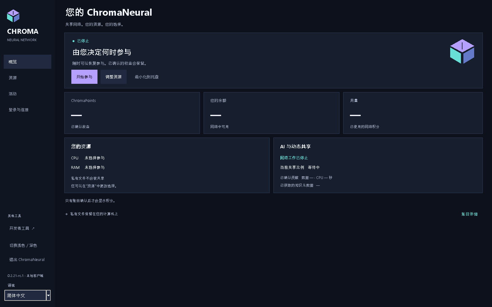
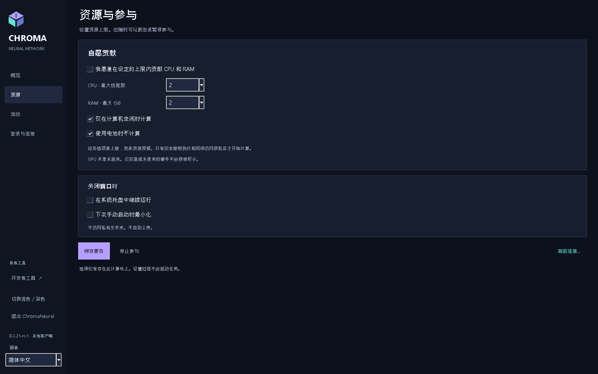
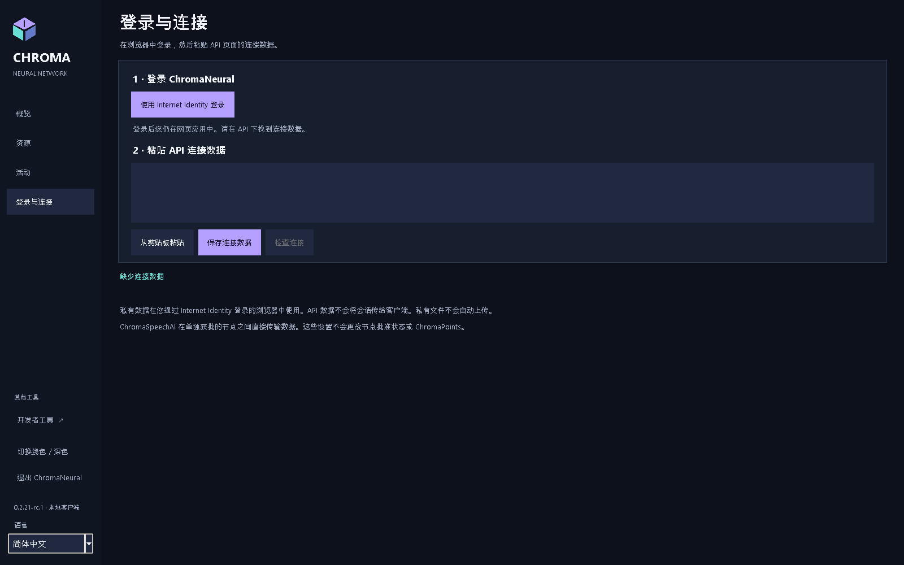
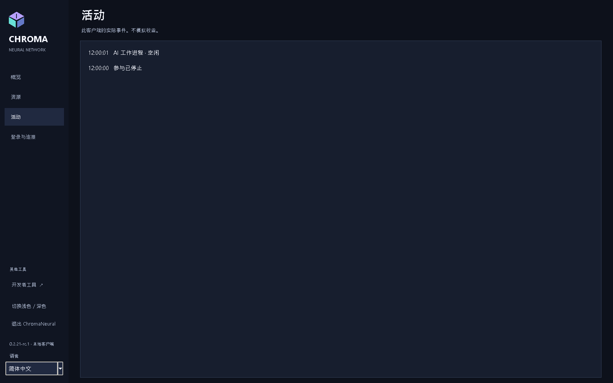

<p align="center"></p>
<p align="center"><strong>ChromaNeural 0.2.21-rc.4</strong><br>发布候选 / 预发布版本</p>
<p align="center"><a href="RELEASE_NOTES.md">RC4</a> · <a href="INSTALLATION.md">安装</a> · <a href="docs/README.md">文档及英语 PDF</a> · <a href="VERIFICATION.md">已验证能力</a> · <a href="KNOWN_LIMITATIONS.md">限制</a></p>

# ChromaNeural

**RC4仅支持Windows x64和Linux amd64。**

[English](README.md) · [Dansk](README-DK.md) · [Deutsch](README-DE.md) · [Français](README-FR.md) · [日本語](README-JA.md) · [简体中文](README-ZH-CN.md) · [हिन्दी](README-HI-IN.md)

**RC4已发布预发行版：VERIFIED/PASS。** Windows/Linux软件包、首次干净启动及所有者手动验收均已通过。[状态与限制](RELEASE_NOTES.md)。

**本地 AI 工作、已认证对等协作，以及私人工作与共享结果之间的明确边界。**

ChromaNeural 是供明确批准 AI 工作使用的桌面客户端和软件框架，结合持久本地队列、可选本地 AI 提供者、认证 ChromaSpeechAI 节点传输和同意控制的结果发布。支持的协作是**代码提案**，不是接收任意远程任务的通用系统。

历史 rc.1 为 **Windows、Linux、macOS** 提供按平台限制测试的软件。真实双机 LAN、移动到家庭网络的直接 WAN、实际本地推理补充原生包检查。**生产网络线上准入、迁移、Internet Identity 全流程尚未验证。** 安装不会加入收益网络或部署后端。

## ChromaNeural 的特点

- **从本地工作开始。** 打开工作区不上传它；本地提供者在本机处理明确选择输入。
- **协作经过明确选择。** 节点身份、任务批准、源披露同意彼此分离。收到内容只是数据，不自动执行。
- **完整性不是真实性。** SHA-256 相同证明字节一致，不让 AI 答案自动通过验证或获得发布许可。
- **身份有边界。** 人的 Internet Identity 会话留在浏览器，节点有独立签名身份，复制 Principal 不是认证凭据。
- **发布是单独决定。** 私人文件、本地结果、Shared Network Knowledge 不能互换存储。验证、同意、角色和后端接受仍适用。

这是具体软件边界，不承诺匿名、本地加密或 AI 永远正确。见[隐私与存储](docs/zh-CN/ChromaNeural-Privacy-and-Storage.md)。

## rc.3 客户端语言

同一个客户端支持 English、Dansk、Deutsch、Français、日本語、简体中文和 हिन्दी。默认及回退语言均为英语，与操作系统语言无关。侧栏语言选择器会立即切换应用自身的文本，保留现有输入、源文本、连接 JSON 和参与状态；切换不会启动额外工作进程或网络探测。操作系统自带文件选择控件保持系统语言。

在 GUI 中明确选择语言后，仅将版本和语言标识保存到现有 `preferences.json` 旁的 `ui-language.json`。不会更改原设置架构或创建第二个状态根目录。下次启动恢复选择。缺失、无效、过大或不受支持的语言设置均回退英语，不改写原文件。之后明确保存时会保留无效原件；保存失败则保留当前语言。

可选 CLI 参数 `--language` 只覆盖本次启动，不保存。Windows 启动器传递 `-Language`。支持的标识来自 `client/locale-registry.json`，首批为 `en`、`da`、`de`、`fr`、`ja`、`zh-CN`、`hi-IN`。新增语言只需包含相同消息键的一个目录资源，以及含显示名称和数字格式元数据的一个注册项。验证用临时第八语言不随产品交付。

## 界面一览

<p align="center">

</p>

<table>
<tr>
<td width="50%" valign="top">
<br>
<strong>由您选择资源</strong><br>CPU、线程、内存和参与。
</td>
<td width="50%" valign="top">
<br>
<strong>浏览器登录与客户端连接独立</strong><br>不向桌面转移 Internet Identity 会话。
</td>
</tr>
</table>

<details>
<summary>活动和截图背景</summary>
<p align="center">

</p>
</details>

[已验证截图](docs/images/rc2/README.md) · [截图来源](docs/SCREENSHOTS.md) · [文档及英语 PDF](docs/README.md).

## 软件能力

| 能力 | 可用范围 |
|---|---|
| 后台工作 | 已批准本地任务通过现有持久队列，支持租约、暂停、取消、停止和重启。 |
| 本地 AI | Windows/Linux 内置 CPU/Qwen；明确选择本地 Ollama 和模型。无静默回退。 |
| 对等协作 | 已批准问答通过现有 TLS 和 SQLite 收件箱关联原代码提案任务。 |
| 资源控制 | 所述 Windows CPU 配置控制 CPU 调度、线程、提交内存及生命周期，不保证总物理 RAM。其他受控提供者／OS 配置安全拒绝。 |
| 结果 | 本地与节点贡献保留来源和审查状态，现有权威验证接受前仍未验证。 |
| 发布 | 同意、验证、角色控制的现有软件经本地测试；本预发布不证明公开线上结果服务。 |
| 连接 | 桌面匿名检查公开 API，私人浏览器登录和单独授权节点设置是不同操作。 |

**通用资源共享仍禁用。** 保存偏好或公开检查成功不证明准入、实际贡献或 ChromaPoints。此 RC 无提交任意问题的通用按钮，高级队列／协作使用现有 CLI。

## 工作如何流转

```text
本地输入 + 明确批准
              |
       现有工作队列
              |
    本地提供者 / 已批准节点交换
              |
     关联结果 + 完整性检查
              |
       审查 / 验证
              |
  仅按既有规则可选发布
```

不会自动执行收到的代码，不由 AI 自我验证，不因保存或下载发积分。可选全局发布前请求者直接私人下载在本版延期。

## 隐私、存储和浏览器

桌面本地保存设置、队列和日志。所选工作区仍是您控制的普通文件夹。队列可含源文本、指令、结果和路径，**应作为私人数据保护**。应用不加密本地状态。

| 位置 | 默认 |
|---|---|
| Windows 状态 | `%LOCALAPPDATA%\ChromaNeural\client` |
| Linux 状态 | `${XDG_STATE_HOME:-$HOME/.local/state}/chroma-neural/client` |
| 工作文件 | 明确选择的目录，不自动上传整个目录 |
| 浏览器私人数据 | 已认证 Internet Identity 调用者下的现有 Web 应用 |

`--state-dir` 或 `CHROMA_STATE_DIR` 可指定其他状态目录。节点身份／配置、收件箱各有明确路径。[文件名、保留和会话边界](docs/zh-CN/ChromaNeural-Privacy-and-Storage.md)。

**Private II storage** 仅为信息。浏览器所有者授权的原生私人上传／下载未实现。使用 Web 不转移会话到节点。本地隐私／访问防护验证不证明修正已部署线上。

## RC4平台与下载

| 官方预发布平台 | 下载 | 验证范围 |
|---|---|---|
| Windows x64 | [Windows EXE](RELEASE_NOTES.md) | 原生全新安装、SDK/CLI/Tk、完整性、人工 GUI |
| Linux amd64 | [Debian 包](RELEASE_NOTES.md) | 原生 Ubuntu 24.04 构建、解压、SDK/CLI、Xvfb/Tk，不含完整安装／删除 |
| 源代码 | [已接受源 ZIP](RELEASE_NOTES.md) | 已接受发行的源码，当前文档可能更新 |

**前提：** Windows：Python 3.14、Tk、`py`/`pyw`、Node.js 24。Linux：Python 3.11+、Tk、cryptography、Node.js 20+、libgomp1。下载前读[安装](INSTALLATION.md)。

软件包**未签名**。系统可能显示安全警告。请参阅[品牌状态](docs/BRANDING.md)。


### 验证下载

同时获取 [SHA256SUMS.txt](RELEASE_NOTES.md)。Windows 使用 `Get-FileHash -Algorithm SHA256`，Linux `sha256sum`。比较精确文件名对应的全部值。SHA-256 验证字节而非发布者身份。[全部公开哈希与命令](docs/DOWNLOADS.md)。

GitHub 将 DEB 名从 `~rc.1` 改为 `.rc.1`，字节和内容哈希不变。

## 文档

保留的 rc.2 文档基线为 VERIFIED/PASS：七语言35份 PDF、195页视觉审查、字体嵌入与子集化，以及印地语 Unicode 提取均已验证。[已验证 PDF](docs/pdf/rc2/README.md)和[28张已验证截图](docs/images/rc2/README.md)保留原始来源信息。下方 rc.1 PDF 链接为历史资料。MCP 由专门补充文档说明。

| 指南 | Markdown | 历史 rc.1 英语 PDF |
|---|---|---|
| 概览 | [系统和工作流](docs/zh-CN/ChromaNeural-Overview.md) | [概览](docs/pdf/ChromaNeural-Overview.pdf) |
| 用户 | [使用客户端](docs/zh-CN/ChromaNeural-User-Guide.md) | [用户](docs/pdf/ChromaNeural-User-Guide.pdf) |
| 隐私与存储 | [数据、路径、身份](docs/zh-CN/ChromaNeural-Privacy-and-Storage.md) | [隐私与存储](docs/pdf/ChromaNeural-Privacy-and-Storage.pdf) |
| 安装 | [Windows、Linux](INSTALLATION.md) | [安装](docs/pdf/ChromaNeural-Installation.pdf) |
| 已验证能力 | [证据与限制](docs/zh-CN/ChromaNeural-Verified-Capabilities.md) | [已验证能力](docs/pdf/ChromaNeural-Verified-Capabilities.pdf) |

开发者：[复现与证据](VERIFICATION.md)、[贡献](CONTRIBUTING.md)、[变更](CHANGELOG.md)、[许可证边界](docs/LICENSING.md)。

## 尚未验收

线上 Internet Identity 全流程、准入、迁移仍**未验证**。原生私人文件集成与所有者直接私人结果访问未交付。所述 Windows 以外受控资源贡献不支持。反向 WAN 受测试环境限制。见[全部已知限制](KNOWN_LIMITATIONS.md)。

这是**软件文档**，真实 LAN/WAN 与模型推理区别于本地／模拟测试。不声称专用 GPU、光学或其他硬件性能已物理验证。

在 rc.3 中，ChromaSpeechAI 仍负责节点到节点通信；可选 MCP 负责节点到工具通信。ChromaNeural 无需 MCP 也可独立运行。连接及各个工具均需明确批准。

## 开源与贡献

ChromaNeural 自有代码与文档采用 **Apache License 2.0**。记录的四个 Refract Editor 文件以及指定 ChromaPlex/CPL/CPA、ChromaSpeechAI 组件保留 **MIT**。**PRISME 保留独立限制条款，此处不重新许可。** 其他依赖保留各自声明。参见 [LICENSE](LICENSE)、[NOTICE](NOTICE)、[THIRD_PARTY_LICENSES.md](THIRD_PARTY_LICENSES.md) 和[精确范围](docs/LICENSING.md)。

欢迎问题报告、文档改善和兼容贡献。遵循 [CONTRIBUTING.md](CONTRIBUTING.md)，不附私人身份、队列数据库、会话或未脱敏日志。安全问题按 [SECURITY.md](SECURITY.md) 报告。


MCP 及集成式 AI／工具配置：VERIFIED/PASS。Ollama 0.35.1 上的真实模型 `qwen3:4b-instruct` 调用了一次获批的受控 MCP 工具，在下一次推理请求中收到完全一致的结果，并在最终输出中使用了该结果。MCP 禁用或不可用时的普通推理也已通过。这不代表所有模型或外部服务均已认证。参见 [MCP 与配置（英文）](docs/MCP_ONBOARDING.md)。
