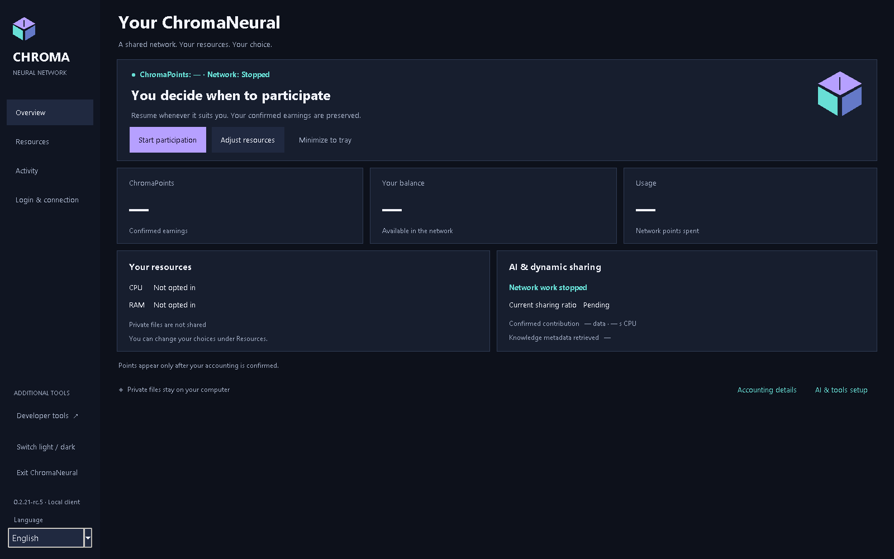

# ChromaNeural

Local AI work. Explicit collaboration. Your choice.

**0.2.21-rc.5 - development candidate, not a published release.**
[Dansk](README-DK.md) · [User guide](docs/en/guide.md) · [Installation](docs/en/installation.md) · [Privacy](docs/en/privacy.md)

ChromaNeural is a Windows/Linux desktop client for approved local AI work and authenticated peer collaboration. English is the default; the application retains all seven existing UI languages. RC5 release documentation is maintained in English and Danish.

## What the client does

- Keeps resource preferences and shows confirmed accounting status. A dash means unavailable, not zero earnings.
- Offers local AI proposals through the existing bundled CPU or explicitly selected Ollama provider. Review a proposal before applying it.
- Keeps approved tasks in the existing WorkQueue. ChromaSpeechAI handles node-to-node communication.
- Offers optional MCP node-to-tool access through individually approved connections and tools. Ordinary local work remains available without MCP.
- Separates browser Internet Identity login from the desktop's public API connection check.

General resource sharing remains disabled. Local actions cannot award ChromaPoints. Remote execution remains disabled. There is no automatic private-file upload, network admission or global publication.

## RC5 distribution

The release targets are Windows x64 and Linux amd64. The Windows candidate uses Inno Setup; the planned authoritative build runs from a clean GitHub Actions checkout. Test signing uses the owner's existing SignPath test policy only. A self-signed test certificate is **not** trusted public release signing.

No RC5 download or production-signing PASS is claimed here. The withdrawn RC4 guides and screenshots are not reused. See [release status](RELEASE_NOTES.md), [build/signing gates](docs/BUILDING.md) and [code signing policy](docs/SIGNING.md).

## Limits and licenses

Live Internet Identity end-to-end, live node admission, live migration and LAN Build05/main API interoperability remain NOT VERIFIED. General controlled Linux/Ollama/GPU contribution is unsupported. No physical optical/GPU performance claim is made.

ChromaNeural code uses Apache-2.0; identified components retain their own terms. Read [license boundaries](docs/LICENSING.md), [LICENSE](LICENSE), [NOTICE](NOTICE) and [third-party licenses](THIRD_PARTY_LICENSES.md). A root license alone does not establish SignPath Foundation eligibility.
