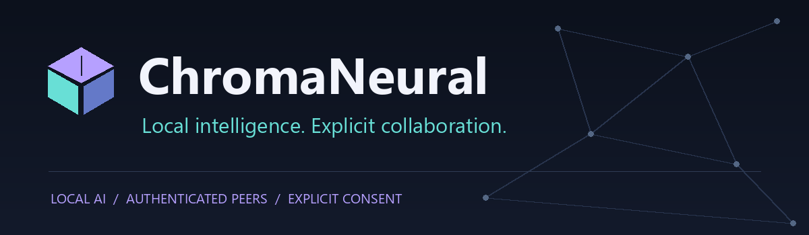
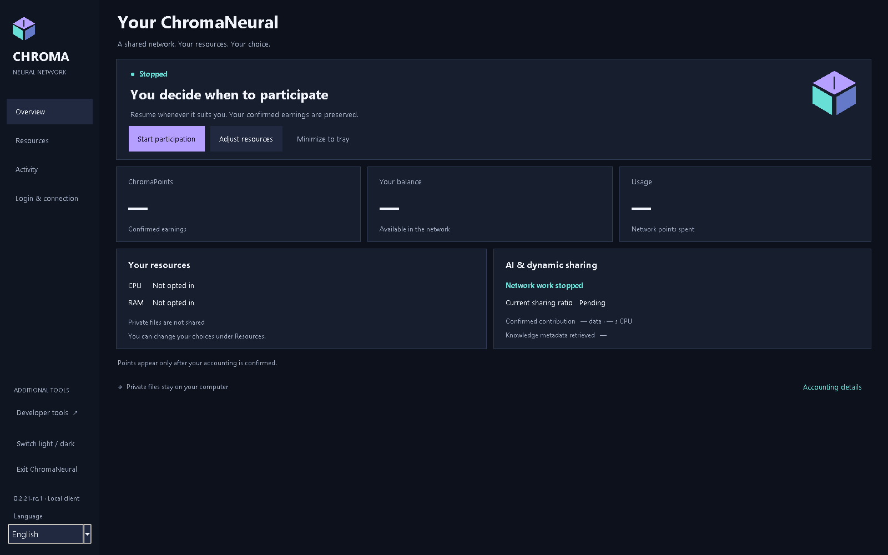
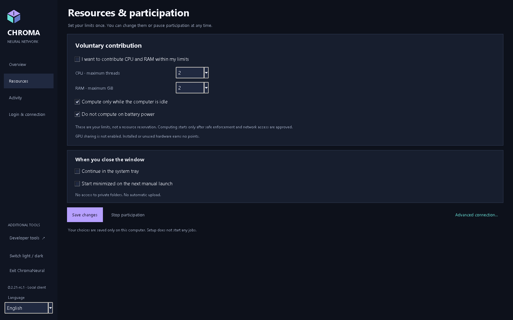
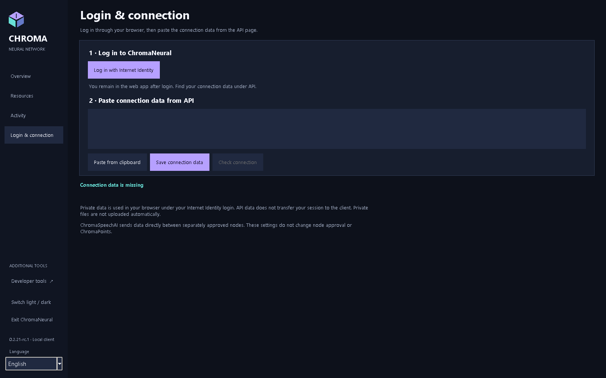
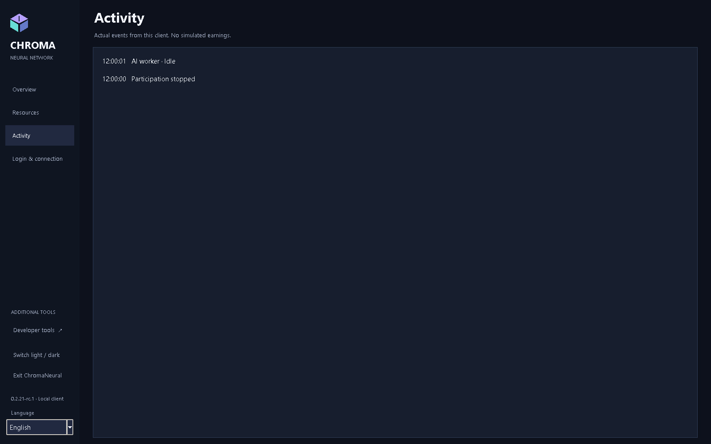

<p align="center"></p>

<p align="center"><strong>ChromaNeural 0.2.21-rc.4</strong><br>Release Candidate / Prerelease</p>
<p align="center"><a href="RELEASE_NOTES.md">RC4</a> · <a href="INSTALLATION.md">Install</a> · <a href="docs/README.md">Documentation & English PDFs</a> · <a href="VERIFICATION.md">Verified capabilities</a> · <a href="KNOWN_LIMITATIONS.md">Limitations</a></p>

# ChromaNeural

**RC4 release platforms: Windows x64 and Linux amd64 only.**

[English](README.md) · [Dansk](README-DK.md) · [Deutsch](README-DE.md) · [Français](README-FR.md) · [日本語](README-JA.md) · [简体中文](README-ZH-CN.md) · [हिन्दी](README-HI-IN.md)

**RC4 published prerelease: VERIFIED/PASS.** Windows/Linux packages, clean-state startup and owner manual acceptance passed. [Current status and limits](RELEASE_NOTES.md).

**Local AI work, authenticated peer collaboration, and a clear boundary between private work and shared results.**

ChromaNeural is a desktop client and software framework for explicitly approved AI work. It combines a persistent local work queue, selectable local AI providers, authenticated ChromaSpeechAI peer transport, and a consent-controlled result-publication path. The supported collaboration profile in this release is **code proposals**; it is not a general-purpose system that accepts arbitrary remote work.

The historical rc.1 release delivered tested software for **Windows, Linux and macOS**, with platform-specific limits. Real two-computer LAN tests, a direct cellular-to-home WAN test, and actual local model inference complement native package checks. **The production network's live admission, migration and Internet Identity end-to-end flow are not yet verified.** Installing the client does not join an earning network or deploy a backend.

## Why ChromaNeural is different

- **Local work is the starting point.** Opening a workspace does not upload it. A local provider processes the explicitly selected input on your computer.
- **Collaboration is deliberate.** Peer identity, job approval and source-disclosure consent remain separate. Received peer content stays data; it is not automatically executed.
- **Integrity is not truth.** Matching SHA-256 hashes establish byte identity. They do not make an AI answer verified or authorise publication.
- **Identity has boundaries.** Your human Internet Identity session stays in the browser. A node has its own signing identity; a copied Principal identifier is not an authentication credential.
- **Publication is a separate decision.** Private files, local results and Shared Network Knowledge are not interchangeable storage areas. Verification, consent, roles and backend acceptance still apply.

These are concrete software boundaries, not a claim of anonymity, encrypted local storage, or universal AI correctness. See the [privacy and storage guide](docs/en/ChromaNeural-Privacy-and-Storage.md).

## Language in the rc.4 client

One client supports English, Dansk, Deutsch, Français, 日本語, 简体中文 and हिन्दी. English is the default and fallback, independently of the OS language. Use the sidebar language selector to change application-owned labels immediately. Existing inputs, source text, connection JSON and participation state are preserved; a language change does not start another worker or network probe. OS-owned file-picker controls retain the OS language.

An explicit GUI selection saves only version and locale in `ui-language.json`, beside the existing `preferences.json`. It does not alter that file's schema or create another state root. The choice is restored at next start. Missing, invalid, oversized or unsupported language preferences fall back to English without rewriting the original. An explicit later save preserves an invalid original; a failed save keeps the current language.

The optional `--language` CLI argument overrides the language for that launch without saving the override. Windows launchers forward `-Language`. Supported locale identifiers come from `client/locale-registry.json`; the initial shipping set is `en`, `da`, `de`, `fr`, `ja`, `zh-CN`, `hi-IN`. A future language requires one catalogue with the same message keys and one registry entry containing its name and number-format metadata. The temporary eighth verification locale is not shipped.

## A look inside

<p align="center">

</p>

<table>
<tr>
<td width="50%" valign="top">
<br>
<strong>Your resource choices</strong><br>
CPU, threads, memory and participation preferences.
</td>
<td width="50%" valign="top">
<br>
<strong>Browser login, separate client connection</strong><br>
No Internet Identity session is transferred to the desktop.
</td>
</tr>
</table>

<details>
<summary>Activity</summary>
<p align="center">

</p>
</details>

[Capture provenance](docs/images/rc2/README.md) · [Screenshot history](docs/SCREENSHOTS.md) · [Documentation](docs/README.md).

## What the software does

| Capability | What is available in this release |
|---|---|
| Background work | Already approved local jobs run through the existing persistent queue, with leases, pause, cancellation, stop and restart handling. |
| Local AI providers | Bundled CPU/Qwen path on Windows/Linux; explicit local Ollama adapter with a selected model. No silent provider fallback. |
| Peer collaboration | Approved questions and replies remain correlated to the original code-proposal task using the existing TLS transport and SQLite inbox. |
| Resource controls | Documented Windows bundled-CPU profile controls CPU scheduling, inference threads, committed memory and lifecycle. Total physical RAM is not guaranteed. Other controlled provider/OS profiles fail closed. |
| Results | Local and peer contributions retain their origin and review status. Output remains unverified until the existing authoritative verification process accepts it. |
| Publication | Existing consent, verification and role-controlled publication software is locally tested. This prerelease does not demonstrate a live public results service. |
| Connection | The desktop checks the public backend API anonymously. Private browser login and separately authorised node setup are different operations. |

**General resource sharing remains disabled.** A saved preference or successful public connection check does not establish admission, active contribution or ChromaPoints. There is no generic task-submission button for arbitrary problems in this RC; advanced queue/collaboration operations use the existing CLI.

## How work moves through the system

```text
Local input + explicit approvals
              |
       Existing work queue
              |
    Local provider / approved peer exchange
              |
     Correlated result + integrity checks
              |
       Review / verification
              |
  Optional publication only under existing rules
```

There is no automatic execution of received peer code, self-verification by the AI, or award of points for merely saving/downloading a result. Direct private requester-download before optional global publication is deferred in this version.

## Privacy, storage and the browser

The desktop stores settings, queue data and logs locally. A selected workspace remains an ordinary folder under your control. Queue records can contain source text, instructions, results and local file paths: **protect them as private data**. Local state is not encrypted by the application.

| Location | Default |
|---|---|
| Windows client state | `%LOCALAPPDATA%\ChromaNeural\client` |
| Linux client state | `${XDG_STATE_HOME:-$HOME/.local/state}/chroma-neural/client` |
| Work files | The folder you explicitly choose; no automatic whole-folder upload |
| Browser-owned private data | The existing web application under the authenticated Internet Identity caller |

`--state-dir` or `CHROMA_STATE_DIR` can select another state directory. Node identity/configuration and peer inboxes have their own explicitly selected paths. [Exact filenames, retention and session boundaries](docs/en/ChromaNeural-Privacy-and-Storage.md).

The **Private II storage** desktop entry is informational in this release. Native private-file upload/download through the browser owner's authority is not implemented. Use of the existing browser application does not transfer its session to the node. Local privacy/access-guard verification does not prove that those corrections have been deployed to the live service.

## RC4 platforms and downloads

| Official prerelease platform | Download | Verified scope |
|---|---|---|
| Windows x64 | [Windows EXE](RELEASE_NOTES.md) | Native clean install, SDK/CLI/Tk, payload integrity and manual Windows GUI acceptance |
| Linux amd64 | [Debian package](RELEASE_NOTES.md) | Native Ubuntu 24.04 build, extraction, SDK/CLI and Xvfb/Tk; not a full install/remove lifecycle |
| Source | [Accepted source ZIP](RELEASE_NOTES.md) | Source at the accepted release; current documentation may be newer |

**Prerequisites:** Windows: Python 3.14 with Tk and `py`/`pyw`, Node.js 24. Linux: Python 3.11+, Tk, cryptography, Node.js 20+, libgomp1.  Read [installation instructions](INSTALLATION.md) before downloading.

Packages are **unsigned**. OS security warnings may appear. See [branding status](docs/BRANDING.md).


### Verify your download

Download [SHA256SUMS.txt](RELEASE_NOTES.md) with your package. On Windows use `Get-FileHash -Algorithm SHA256`; on Linux use `sha256sum`. Compare the full value for the exact filename. SHA-256 verifies bytes, not publisher identity. [All published hashes and commands](docs/DOWNLOADS.md).

GitHub changed the DEB download name from `~rc.1` to `.rc.1`. The DEB bytes and content hash are unchanged.

## Documentation

The preserved rc.2 documentation baseline is VERIFIED/PASS: 35 PDFs in seven languages, 195 pages visually reviewed, embedded/subset fonts and Hindi Unicode extraction verified. [Verified PDFs](docs/pdf/rc2/README.md) and [28 verified screenshots](docs/images/rc2/README.md) retain their original provenance. The rc.1 PDF links below are historical. MCP is covered by the focused supplement.

| English guide | Markdown | Historical rc.1 PDF |
|---|---|---|
| Overview | [System and workflow](docs/en/ChromaNeural-Overview.md) | [Overview](docs/pdf/ChromaNeural-Overview.pdf) |
| User guide | [Using the client](docs/en/ChromaNeural-User-Guide.md) | [User guide](docs/pdf/ChromaNeural-User-Guide.pdf) |
| Privacy and storage | [Data, paths and identity](docs/en/ChromaNeural-Privacy-and-Storage.md) | [Privacy and storage](docs/pdf/ChromaNeural-Privacy-and-Storage.pdf) |
| Installation | [Windows, Linux](INSTALLATION.md) | [Installation](docs/pdf/ChromaNeural-Installation.pdf) |
| Verified capabilities | [Evidence and limits](docs/en/ChromaNeural-Verified-Capabilities.md) | [Verified capabilities](docs/pdf/ChromaNeural-Verified-Capabilities.pdf) |

For developers: [reproduction and evidence](VERIFICATION.md), [contributing](CONTRIBUTING.md), [changelog](CHANGELOG.md), [license boundaries](docs/LICENSING.md).

## What remains outside acceptance

Live Internet Identity end-to-end, live admission and live migration remain **NOT VERIFIED**. Native private-file integration and direct private owner-result access are not delivered. Controlled resource contribution outside the documented Windows profile is unsupported. Reverse WAN initiation was limited by the available test environment. See [all known limitations](KNOWN_LIMITATIONS.md).

This is **software documentation**. Actual LAN/WAN transport and actual model inference are distinguished from local/mock tests. No specialised GPU, optical or other hardware performance is claimed as physically verified.

In rc.3, ChromaSpeechAI remains node-to-node; optional MCP is node-to-tool. ChromaNeural remains functional without MCP. Connections and individual tools require explicit approval.

## Open source and contributions

ChromaNeural's own code and documentation use **Apache License 2.0**. The four documented Refract Editor files remain **MIT**, as do the identified ChromaPlex/CPL/CPA and ChromaSpeechAI components. **PRISME retains its separate restrictive terms and is not relicensed here.** Other dependencies retain their respective notices. Read [LICENSE](LICENSE), [NOTICE](NOTICE), [THIRD_PARTY_LICENSES.md](THIRD_PARTY_LICENSES.md) and [the exact scope](docs/LICENSING.md).

Issues, documentation improvements and compatible contributions are welcome. Follow [CONTRIBUTING.md](CONTRIBUTING.md); do not attach private identities, queue databases, session material or unredacted logs. Report security issues using [SECURITY.md](SECURITY.md).


MCP and integrated AI/tool onboarding: VERIFIED/PASS. A real `qwen3:4b-instruct` model on Ollama 0.35.1 invoked one approved controlled MCP tool, received the exact result in its next inference request and used that result in its final output. Ordinary inference with MCP disabled or unavailable also passed. This does not certify every model or external service. See [MCP and onboarding](docs/MCP_ONBOARDING.md).
