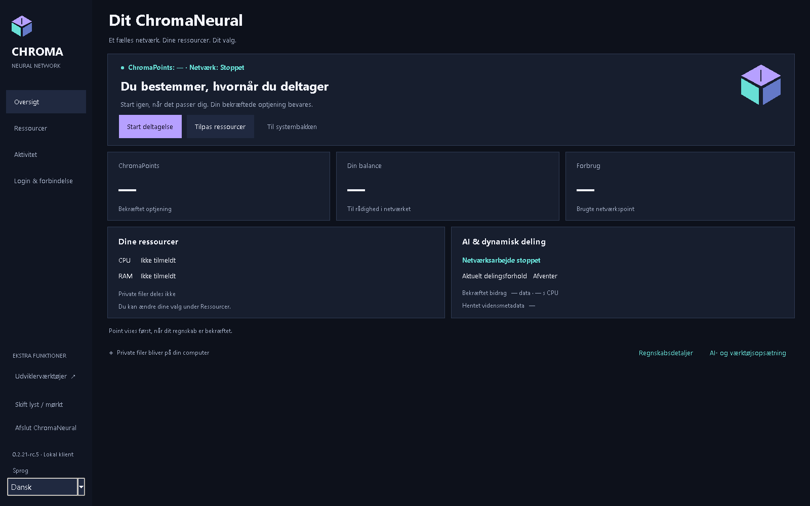
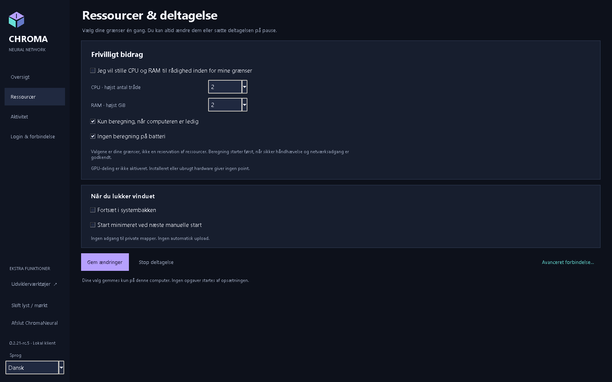
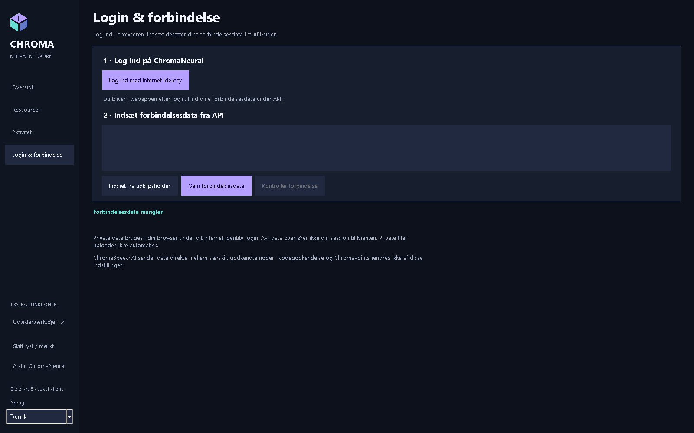
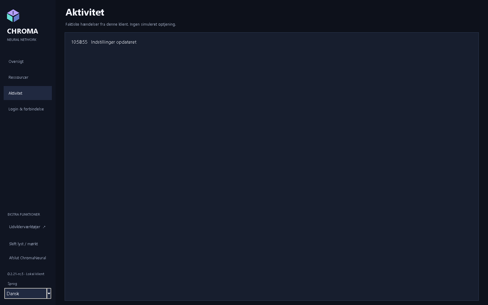
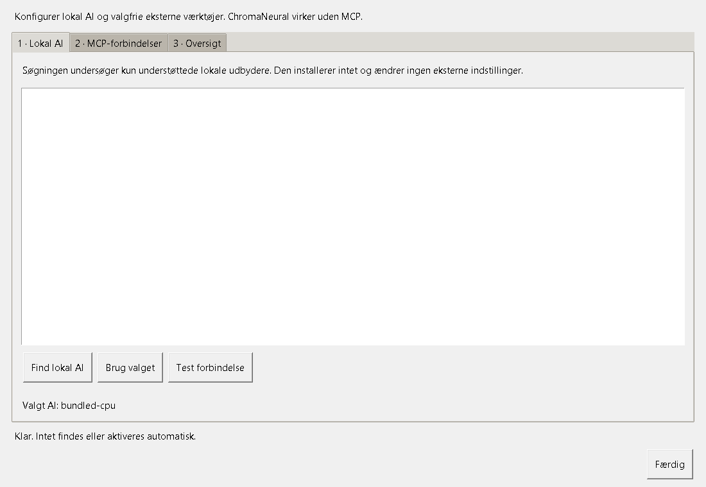
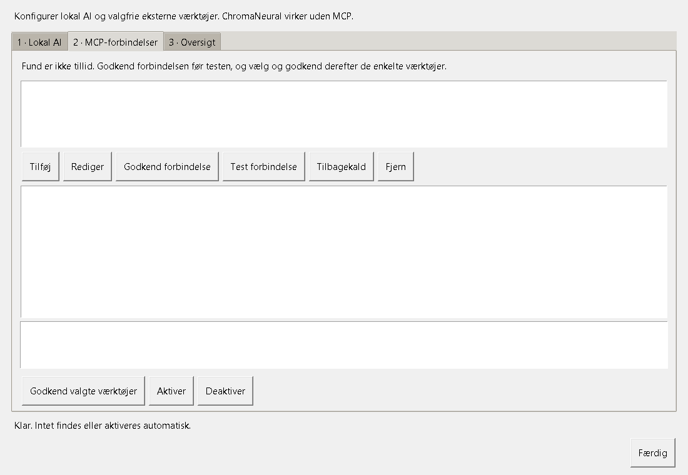

# ChromaNeural RC5 - brugervejledning

[English](../en/guide.md) · [README](../../README-DK.md) · [Installation](installation.md) · [Privatliv](privacy.md)

Version 0.2.21-rc.5. Udviklingskandidat; se [aktuel acceptstatus](../../RELEASE_NOTES.md).

## Første start og sprog

Start ChromaNeural fra Startmenuen i Windows eller programmenuen i Linux. Første start åbner **Ressourcer**. Lad CPU-bidrag være slået fra ved en privat gennemgang, vælg grænser, og tryk **Gem og fortsæt**. Klienten åbner **Oversigt**. Senere bruges **Gem ændringer**. Gemte indstillinger giver ikke adgang til netværket.

Vælg sprog i sidepanelets **Sprog**-vælger. Valget gemmes. Engelsk er standard og fallback. `--language da` gælder kun den aktuelle start; Windows-launcheren accepterer `-Language da`. Applikationen beholder også tysk, fransk, japansk, forenklet kinesisk og hindi.

## Oversigt og regnskab

**Oversigt** viser ChromaPoints, saldo, forbrug, ressourcer og netværksstatus. Tallene kommer kun fra den eksisterende verificerede regnskabstilstand. En tankestreg betyder, at en bekræftet værdi ikke er tilgængelig. Regnskabsdetaljerne åbner den detaljerede visning; regnskabet i **Udviklerværktøjer** er også bevaret. Lokale indstillinger og værktøjer kan ikke tildele point.

**AI- og værktøjsopsætning** åbner provider- og MCP-konfiguration. Minimering til systembakken er tilgængelig, hvor platformen understøtter det. Windows-bakkens status bruger samme regnskabs- og delingstilstand og beregner ikke point.

## Ressourcer

1. Åbn **Ressourcer**.
2. Vælg maksimalt antal inferenstråde og hukommelsespræference.
3. Vælg adfærd ved inaktivitet og batteridrift samt systembakke, hvor det understøttes.
4. Vælg **Gem ændringer**; klienten vender tilbage til **Oversigt**.

Grænser reserverer ikke hardware. Den accepterede Windows-profil med medfølgende CPU-runtime begrænser scheduling, tråde og committed memory, ikke samlet fysisk RAM. Generel ressourcedeling er deaktiveret; kontrolleret Ollama-/Linux-/GPU-bidrag understøttes ikke. Tilgængelig hardware er ikke indtjening.

## Login & forbindelse

1. Åbn **Login & forbindelse**. En ren installation har et tomt felt til forbindelsesdata.
2. **Log ind med Internet Identity** åbner den eksisterende webapplikation i browseren.
3. Kun når du selv vælger at forbinde, kopierer du din egen API-profil fra webapplikationen, indsætter den og vælger **Gem forbindelsesdata**. Brug ikke en andens profil.
4. **Kontrollér forbindelse** tester det offentlige API. Det kopierer ikke browsersessionen og etablerer ikke adgang til private filer.

En vellykket kontrol viser **Backend svarer · offentligt API nået** og **Privat login er fortsat i browseren**. Live privat II-adgang, live nodeadgang og live migration er NOT VERIFIED. Indsæt ingen private data under gennemgang af releasebilleder eller test af en ren installation.

## Aktivitet og afslutning

**Aktivitet** viser lokale hændelser. En gemt indstilling beviser ikke netværksarbejde, verificeret AI-kvalitet eller optjente point. Pause og stop følger fortsat de eksisterende workerregler.

Vælg **Afslut ChromaNeural** for at lukke helt. Vinduets lukkeknap kan minimere til systembakken, når dette er valgt og understøttet. Luk klienten før sikkerhedskopiering af lokal tilstand.

## Lokal AI og valgfri MCP

Åbn **AI- og værktøjsopsætning**, vælg **Find lokal AI**, vælg en tilgængelig provider/model og tryk **Brug valget**. **Test forbindelse** beder om samtykke før en lille inferens. Søgningen installerer ingen runtime, henter ingen model og starter ingen tjenester. Manglende software konfigureres separat.

Den lokale redigering findes fortsat under **Udviklerværktøjer**: vælg en lokal arbejdsmappe og tekstfil, bed om et lokalt AI-forslag, og gennemgå det før anvendelse og lagring. Valg af en mappe giver ikke delingstilladelse. Provider/model skiftes ikke tavst.

I MCP-opsætningen vælger du **Tilføj** og navngiver forbindelsen. Vælg et installeret lokalt program eller et eksternt MCP-endpoint. Gem, gennemgå målet og vælg **Godkend forbindelse**. Brug **Test forbindelse** til at finde værktøjer, vælg kun de nødvendige, og tryk **Godkend valgte værktøjer** og **Aktiver**. Fundne eller konfigurerede servere er ikke automatisk betroede.

**Deaktiver** blokerer efterfølgende kald; **Tilbagekald** fjerner godkendelser og sessionsoplysninger; **Fjern** fjerner forbindelsen. En ændring af målet ophæver godkendelser og bindingen til sessionstokenet. Tilbagekaldelse kan ikke fortryde et allerede afsendt kald.

Kun eksplicit valgte Ollama-modeller med strukturerede chatværktøjskald kan bruge MCP i den eksisterende Studio-opgavevej. Den verificerede modelbaseline er `qwen3:4b-instruct`; `qwen2.5-coder:0.5b` opfyldte ikke kravet. Medfølgende CPU-inferens og almindeligt arbejde kræver ikke MCP. Et website kræver en MCP-server/adapter og er ikke automatisk et værktøj.

ChromaSpeechAI er node-til-node. MCP er valgfri node-til-værktøj. Værktøjsresultater er ikke-betroede data, ikke peerkommandoer eller udførelsestilladelse. Eksisterende kø-/peeropgaver får ikke automatisk værktøjsadgang. Fjernudførelse forbliver deaktiveret.

## Privatliv, resultater og support

**Privat II-lagring** er en informationsvisning; den implementerer ikke privat filoverførsel mellem browser og klient. Et modelforslag eller peersvar skal stadig gennemgås. SHA-256 kontrollerer bytes, ikke korrekthed. Global publicering kræver verificering, samtykke, roller og backendaccept.

Indsend en redigeret fejlbeskrivelse og applikationsversion. Del aldrig forbindelsesprofil, Principal, token, identitetsmappe, kødatabase eller private filer. Se [privatliv](privacy.md) og [kendte begrænsninger](../../KNOWN_LIMITATIONS.md).

Alle billeder er nye optagelser af den faktiske RC5-GUI med isoleret, tom kontotilstand. De viser dokumentationshandlinger, ikke live netværksaccept eller indtjening.
