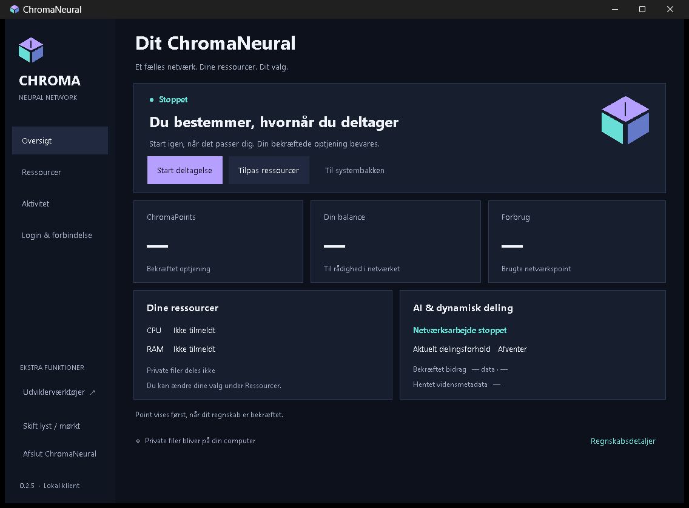
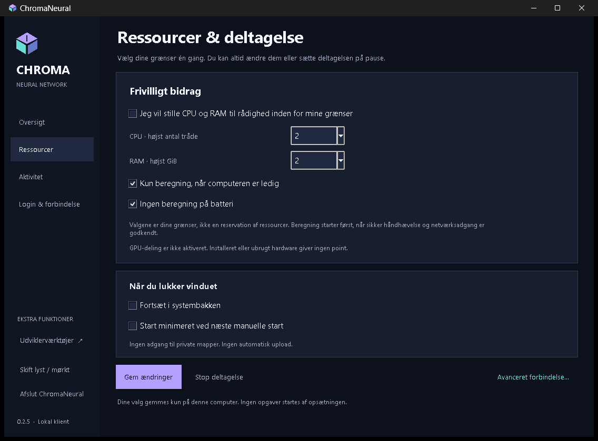
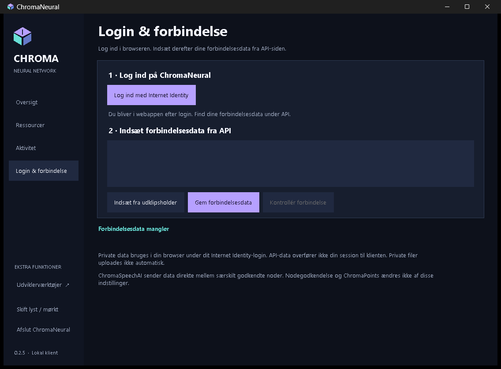
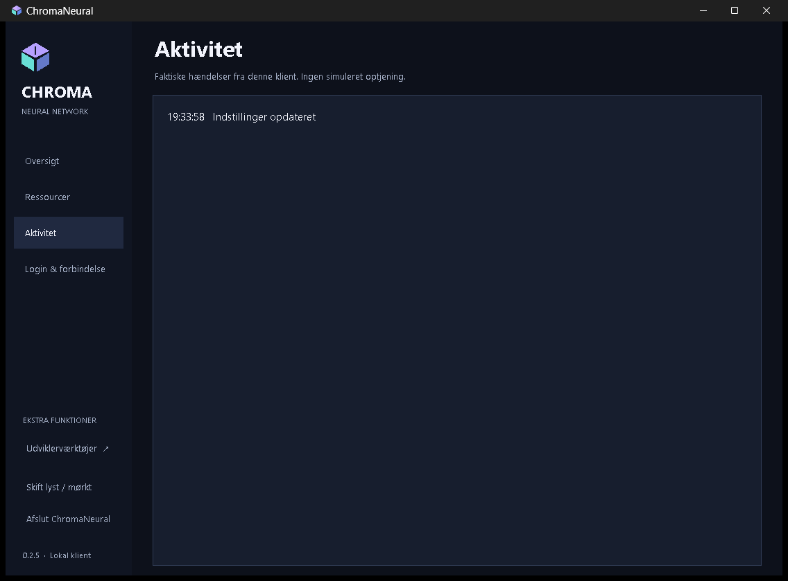

# ChromaNeural

[English](../en/ChromaNeural-User-Guide.md) · [Dansk](../da/ChromaNeural-User-Guide-DA.md) · [Deutsch](ChromaNeural-User-Guide.md) · [Français](../fr/ChromaNeural-User-Guide.md) · [日本語](../ja/ChromaNeural-User-Guide.md) · [简体中文](../zh-CN/ChromaNeural-User-Guide.md) · [हिन्दी](../hi-IN/ChromaNeural-User-Guide.md)
## Benutzerhandbuch

ChromaNeural 0.2.21-rc.2-Dokumentation | Unveröffentlichter Kandidat | 3. Oktober 2026

**Stand der rc.2-Dokumentation:** Dieser Kandidat wurde nicht öffentlich veröffentlicht. Lokalisierung und erweiterbare i18n haben die lokale Verifikation bestanden; die native Build- und Paketabnahme für rc.2 steht noch aus. Die folgenden Installations-, Plattform-, LAN/WAN-, Inferenz- und Live-Dienstnachweise sind historische rc.1-Nachweise, sofern sie nicht ausdrücklich als rc.2 gekennzeichnet sind. rc.1-Downloads enthalten keine rc.2-Lokalisierung.

## 1. Installieren und starten

Laden Sie das passende Plattformpaket der offiziellen GitHub-Veröffentlichung herunter und vergleichen Sie SHA-256 mit der Prüfsummenliste. Installieren Sie die Voraussetzungen des Installationshandbuchs. Das festgelegte ICP SDK ist enthalten; npm oder eine alte Entwicklungsumgebung sind nicht erforderlich.

Unter Windows starten Sie Start-ChromaNeural.ps1 im versionierten Benutzerinstallationsordner. Unter Linux verwenden Sie das Anwendungsmenü oder chromaneural. Unter macOS öffnen Sie ChromaNeural.app nach Installation der dokumentierten Voraussetzungen. Die Pakete sind unsigniert; deaktivieren Sie dafür nicht global den Betriebssystemschutz.

Beim ersten Start erscheinen Ressourceneinstellungen. Wählen und speichern Sie diese. Speichern bewirkt keine automatische Produktionsnetz-Zulassung. Die Beispiele zeigen gestoppte Teilnahme ohne Konto oder private Daten.

Die erhaltenen rc.1-Aufnahmen sind dänisch und zeigen keinen rc.2-Sprachwähler. **Oversigt** bedeutet Überblick, **Ressourcer** Ressourcen, **Aktivitet** Aktivität und **Login & forbindelse** Anmeldung und Verbindung. Die Schritte behalten diese historischen Beschriftungen mit Übersetzung. rc.2 startet auf Englisch, sofern Sie nicht ausdrücklich eine andere Sprache gewählt haben.

Ein Strich bedeutet, dass kein bestätigter Wert verfügbar ist: weder Nullsaldo noch geschätzter Verdienst. Wechseln Sie Seiten über die linke Navigation.

## Sprache im rc.2-Client

Ein Client unterstützt English, Dansk, Deutsch, Français, 日本語, 简体中文 und हिन्दी. Englisch ist unabhängig von der Betriebssystemsprache Standard und Rückfallsprache. Die Sprachauswahl in der Seitenleiste ändert die anwendungseigenen Texte sofort. Eingaben, Quelltext, Verbindungs-JSON und Teilnahmestatus bleiben erhalten; ein Sprachwechsel startet weder einen weiteren Worker noch eine Netzwerkprüfung. Betriebssystemeigene Dateiauswahldialoge behalten die Betriebssystemsprache.

Eine ausdrückliche GUI-Auswahl speichert nur Version und Gebietsschema in `ui-language.json` neben der bestehenden `preferences.json`. Deren Schema bleibt unverändert; es entsteht kein zweites Zustandsverzeichnis. Beim nächsten Start wird die Auswahl wiederhergestellt. Fehlende, ungültige, übergroße oder nicht unterstützte Spracheinstellungen führen zu Englisch, ohne das Original zu überschreiben. Ein späteres ausdrückliches Speichern bewahrt ein ungültiges Original; bei einem Speicherfehler bleibt die aktuelle Sprache erhalten.

Das optionale CLI-Argument `--language` überschreibt die Sprache nur für diesen Start, ohne die Auswahl zu speichern. Die Windows-Starter reichen `-Language` weiter. Unterstützte Kennungen stammen aus `client/locale-registry.json`; zunächst werden `en`, `da`, `de`, `fr`, `ja`, `zh-CN` und `hi-IN` ausgeliefert. Eine zukünftige Sprache benötigt einen Katalog mit denselben Nachrichtenschlüsseln und einen Registry-Eintrag mit Anzeigename und Zahlenformatmetadaten. Das vorübergehende achte Testgebietsschema wird nicht ausgeliefert.

Im rc.2-Client lauten die entsprechenden Beschriftungen in der Sprache dieses Handbuchs:

| Beschriftung der historischen Aufnahme | rc.2-Beschriftung auf Deutsch |
|---|---|
| Oversigt | Übersicht |
| Ressourcer | Ressourcen |
| Aktivitet | Aktivität |
| Login & forbindelse | Anmeldung & Verbindung |
| Udviklerværktøjer  ↗ | Entwicklerwerkzeuge  ↗ |
| Afslut ChromaNeural | ChromaNeural beenden |
| Gem ændringer | Änderungen speichern |
| Gem og fortsæt | Speichern und fortfahren |
| Log ind med Internet Identity | Mit Internet Identity anmelden |
| Gem forbindelsesdata | Verbindungsdaten speichern |
| Kontrollér forbindelse | Verbindung prüfen |
| Backend svarer · offentligt API nået Privat login er fortsat i browseren | Backend antwortet · öffentliche API erreicht Private Anmeldung bleibt im Browser |
| Lokal AI | Lokale KI |
| Privat II-lagring | Privater II-Speicher |

<!-- page -->
## 2. Ressourcen und Teilnahme

1. Öffnen Sie **Ressourcer** (Ressourcen).
2. Wählen Sie maximale Inferenz-Threadzahl und Speichereinstellung.
3. Legen Sie fest, ob nur im Leerlauf gerechnet und bei Akkubetrieb pausiert wird.
4. Wählen Sie das Infobereichsverhalten, sofern unterstützt.
5. Wählen Sie **Gem ændringer** (Änderungen speichern), beim ersten Start **Gem og fortsæt** (Speichern und fortfahren). **Oversigt** führt zurück.

Eine Einstellung ist eine Grenze, keine Hardware-Reservierung. Das dokumentierte Windows-Profil mit gebündelter CPU-Inferenz erzwingt CPU-Zeitplanung, Inferenzthreads und zugesicherten Speicher. Gesamter physischer RAM/RSS ist nicht garantiert. Kontrollierte Ollama-, Linux-, macOS- und GPU-Beiträge sind nicht unterstützt und dürfen nicht als erzwungene Profile beworben werden.

Allgemeine Ressourcenfreigabe bleibt deaktiviert. Start und Pause umgehen weder Auftragsgenehmigungen noch Node-Zulassung oder Ressourcenkontrollen. Installierte oder ungenutzte Hardware verdient keine Punkte.

<!-- page -->
## 3. Anmeldung und Verbindung

1. Öffnen Sie **Login & forbindelse** (Anmeldung und Verbindung).
2. **Log ind med Internet Identity** öffnet die bestehende Webanwendung im Browser. Nutzen Sie Ihre vorhandene Identität; geben Sie niemals Sitzungs- oder Wiederherstellungsdaten weiter.
3. Kopieren Sie die API-Verbindungsdaten der Webanwendung, fügen Sie das Profil im Client ein und wählen Sie **Gem forbindelsesdata** (Verbindungsdaten speichern).
4. **Kontrollér forbindelse** (Verbindung prüfen) prüft die öffentliche API und überträgt keine private Browsersitzung.
5. Bei Erfolg erscheinen **Backend svarer · offentligt API nået** und **Privat login er fortsat i browseren**: Backend antwortet, öffentliche API erreicht, private Anmeldung bleibt im Browser.

Diese Meldung wurde bei der historischen rc.1-Windows-Abnahme beobachtet. Sie belegt öffentliche API-Erreichbarkeit, nicht privaten Zugriff, Node-Zulassung oder Produktionsmigration. Dieses Handbuch verlangt kein Backend-Deployment und keine Backend-Änderung.

Bei Fehlern prüfen Sie Internetzugang, Profil und Python-/Node-Voraussetzungen. Teilen Sie nur bereinigte Fehlerbeschreibungen; Protokolle können lokale Pfade enthalten. Identitäten zurückzusetzen oder Zustand zu löschen ist kein erster Diagnoseschritt.

Tatsächliches Live-II-Ende-zu-Ende bleibt NICHT VERIFIZIERT. Lokale Zugriffsschutzkorrekturen gelten nicht allein wegen einer Clientveröffentlichung als in der öffentlichen Webanwendung bereitgestellt.

<!-- page -->
## 4. Aktivität, Pause und Beenden

Aktivität zeigt vom Client aufgezeichnete Ereignisse: etwa gespeicherte Einstellungen oder den Status einer Aktion. Ein Ereignis allein belegt weder geprüfte KI-Qualität noch Veröffentlichung oder Punkte.

Der unterstützte Worker muss Pause und Stopp beachten. Bereits genehmigte lokale Aufträge behalten beim kontrollierten Neustart ihre Warteschlangenidentität. Empfangener Peer-Inhalt bleibt inaktiv.

**Afslut ChromaNeural** (ChromaNeural beenden) schließt vollständig. Die Fensterschaltfläche kann bei aktiviertem und unterstütztem Infobereichsmodus nur ausblenden. Beenden Sie den Client vor Sicherung oder Verschieben seines Zustands.

<!-- page -->
## 5. Lokale KI und erweiterte Arbeit

Unter **Udviklerværktøjer** (Entwicklerwerkzeuge) liegt die bestehende lokale KI-Funktion. Öffnen oder speichern Sie die betreffende Textdatei. Wählen Sie **Local AI**, unterstützten lokalen Anbieter/Modell und Anweisung; genehmigen Sie die genauen Eingaben. Prüfen Sie den Vorschlag vor Annahme und Speichern. Er ersetzt Ihre Datei nicht automatisch.

Gebündelte CPU/Qwen-Inferenz gibt es unter Windows/Linux. Ein installiertes lokales Ollama-Modell wird ausdrücklich ausgewählt. macOS enthält keine Qwen-Laufzeit. Es gibt keinen automatischen Anbieterwechsel. Manuelle lokale KI ist vom kontrollierten Netzwerk-Ressourcenprofil getrennt.

Warteschlangen- und Peer-Operationen sind erweiterte CLI-Funktionen dieser RC. Vorhandene Befehle: queue-ai, result, task-question, task-accept, task-reply, task-collect und task-status. Nutzen Sie --help und eine ausdrücklich gewählte lokale Konfiguration. Dies ist kein automatischer Live-Onboarding-Weg.

## 6. Private Dateien und Ergebnisse

Arbeiten Sie nur in ausdrücklich gewählten Ordnern. **Private II storage** informiert lediglich und lädt keine privaten Dateien hoch oder herunter. Browser-Eigentümerdaten und Desktopdateien haben noch keinen autorisierten Dateikanal.

Lokale Ergebnisse können als Vorschlag geprüft werden. Eine genehmigte Peer-Antwort ist auch bei passendem SHA-256 nicht automatisch verifiziert. Globale Veröffentlichung verlangt weiterhin Verifikation, Freigabeeinwilligung, Rollen und Backend-Annahme. Herunterladen oder Prüfen vergibt keine ChromaPoints.

Die Aufnahmen bewahren den historischen rc.1-Client. Die alte Fußzeile 0.2.5 ist ein internes Komponentenetikett; die dokumentierte Distribution ist 0.2.21-rc.1.

MCP bleibt eine separat freizugebende Funktion nach rc.2 und ist hier nicht implementiert. Diese Dokumentation beinhaltet keine neue Änderung an Produktion oder Internet Identity.
