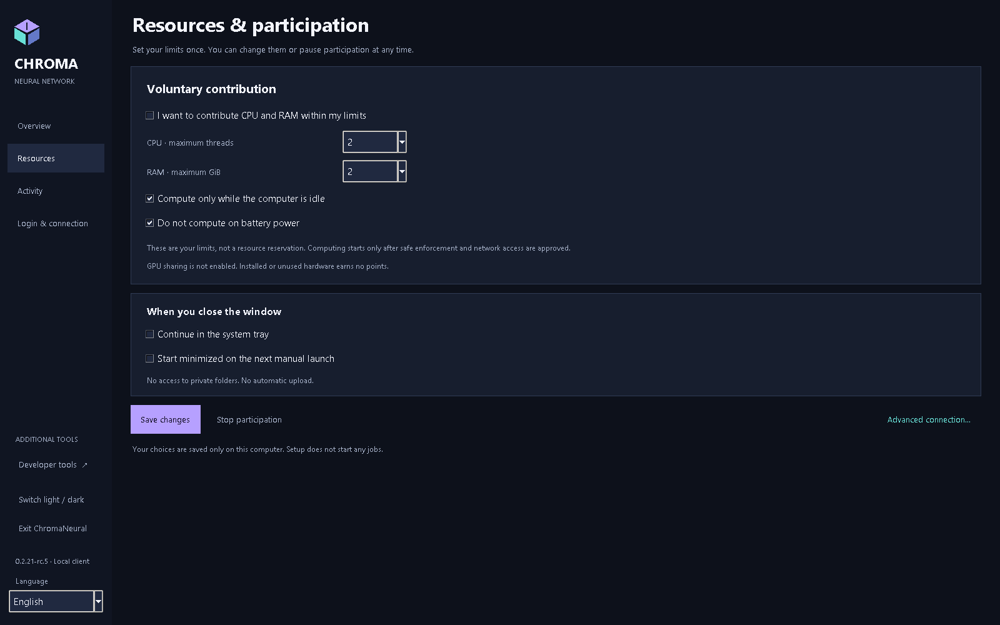
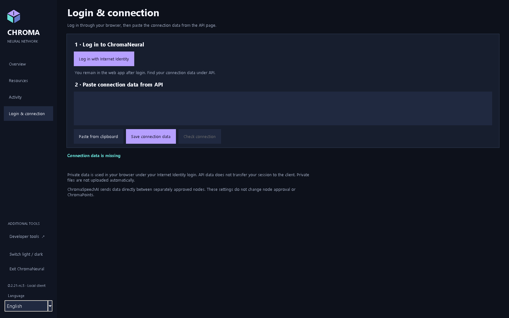
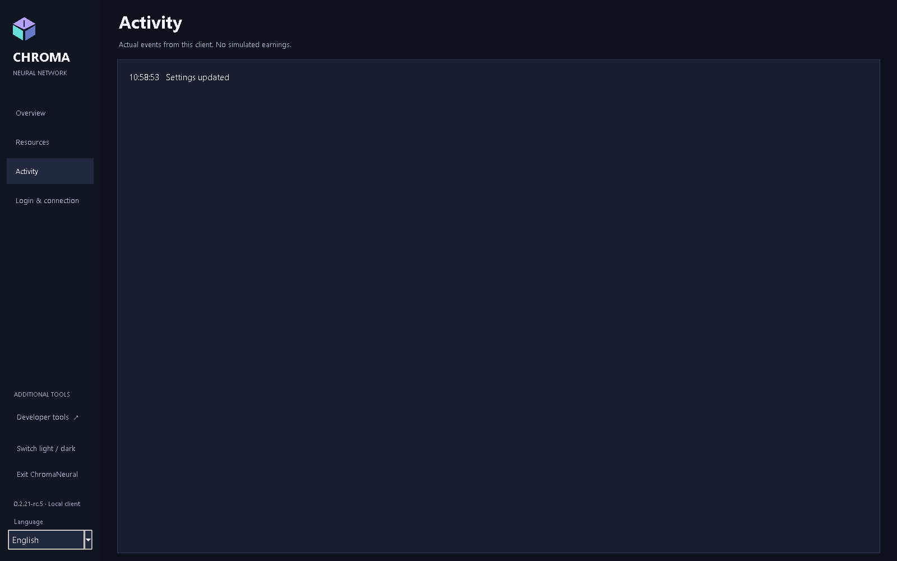
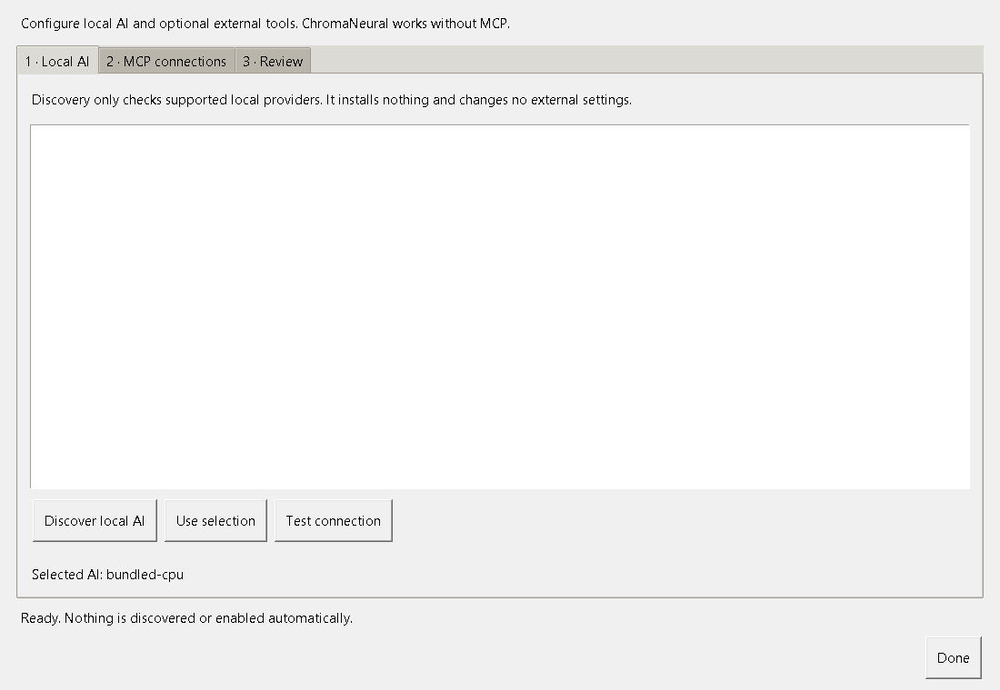
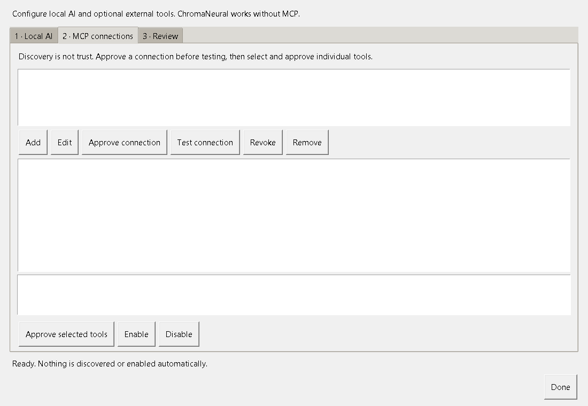

# ChromaNeural RC5 user guide

[Dansk](../da/guide.md) · [README](../../README.md) · [Installation](installation.md) · [Privacy](privacy.md)

Version 0.2.21-rc.5. Development candidate; see [current acceptance status](../../RELEASE_NOTES.md).

## First start and language

Start ChromaNeural from the Start Menu on Windows or the application menu on Linux. First start opens **Resources**. Leave CPU contribution off for a private inspection, choose limits, then select **Save and continue**. The client opens **Overview**. Later visits use **Save changes**. Saving preferences grants no network admission.

The sidebar **Language** selector changes application text and saves your choice. English is the default and fallback. A launch-only override is `--language en`; the Windows launcher accepts `-Language en`. The application also retains Danish, German, French, Japanese, Simplified Chinese and Hindi.

## Overview and accounting

**Overview** shows ChromaPoints, **Your balance**, **Usage**, resources and network status. Only existing verified accounting data supplies these figures. A dash means no confirmed value is available. **Accounting details** opens the detailed view. The accounting view in **Developer tools** remains available. Local settings and tools cannot award points.

**AI & tools setup** opens provider and MCP configuration. **Minimize to tray** hides the window where supported. Windows tray status uses the same accounting/sharing state; it does not calculate points.

## Resources

1. Open **Resources**.
2. Choose the maximum inference threads and memory preference.
3. Choose idle-only and battery behavior and, where supported, tray behavior.
4. Select **Save changes**; the client returns to **Overview**.

Limits do not reserve hardware. The accepted bundled Windows CPU profile constrains scheduling, threads and committed memory, not total physical RAM. General resource sharing is disabled; controlled Ollama/Linux/GPU contribution is unsupported. Do not interpret available hardware as income.

## Login & connection

1. Open **Login & connection**. A clean installation has an empty connection-data editor.
2. **Log in with Internet Identity** opens the existing web application in your browser.
3. Only when you choose to connect, copy your own API profile from that web application, paste it and select **Save connection data**. Do not use another person's profile.
4. **Check connection** tests the public API. It does not copy your browser session or establish private file access.

A successful check displays **Backend responding · public API reached** and **Private login remains in the browser**. Live private II access, live node admission and live migration remain NOT VERIFIED. Do not insert private data while reviewing release screenshots or testing a clean installation.

## Activity and closing

**Activity** records local events. A settings-save event is not proof of network work, verified AI quality or earned points. Pause/stop controls remain subject to the existing worker rules.

Select **Exit ChromaNeural** to close completely. The window close button can minimize to tray when enabled and supported. Exit before backing up local state.

## Local AI and optional MCP

Open **AI & tools setup**, select **Discover local AI**, choose an available provider/model and select **Use selection**. **Test connection** requests consent before a small inference. Discovery does not install a runtime, download a model or start services. Configure unavailable software separately.

The local editing workflow remains under **Developer tools**: choose a local workspace and text file, request a local AI proposal, then review before applying/saving it. Selecting a folder is not permission to share it. No provider/model fallback is silent.

In MCP setup, **Add** a named connection. Choose an installed local executable or a remote MCP endpoint. Save, inspect the target, then **Approve connection**. Use **Test connection** to discover tools, select only needed tools, then **Approve selected tools** and **Enable**. A discovered/configured server is not automatically trusted.

**Disable** prevents subsequent calls; **Revoke** removes approvals/session credentials; **Remove** removes the connection. Editing the target invalidates its approvals and session-token association. Revocation cannot undo a call already sent.

Only explicitly selected Ollama models with structured chat tool calls can use MCP in the existing Studio task path. The verified model baseline is `qwen3:4b-instruct`; `qwen2.5-coder:0.5b` did not satisfy that requirement. Bundled CPU inference and ordinary work do not require MCP. A website needs an MCP server/adapter; it is not automatically a tool.

ChromaSpeechAI is node-to-node. MCP is optional node-to-tool. Tool results are untrusted data, not peer commands or execution authority. Existing queue/peer jobs do not implicitly acquire tools. Remote execution remains disabled.

## Privacy, results and support

**Private II storage** is informational; it does not implement private browser/native file transfer. A model proposal or peer answer remains subject to review. SHA-256 checks bytes, not correctness. Global publication requires verification, consent, roles and backend acceptance.

Report a redacted problem description and application version. Never submit a connection profile, principal, token, identity directory, queue database or private file. See [privacy](privacy.md) and [known limitations](../../KNOWN_LIMITATIONS.md).

All images above are fresh captures of the actual RC5 GUI with isolated empty account state. They show documentation interactions, not live network acceptance or income.
